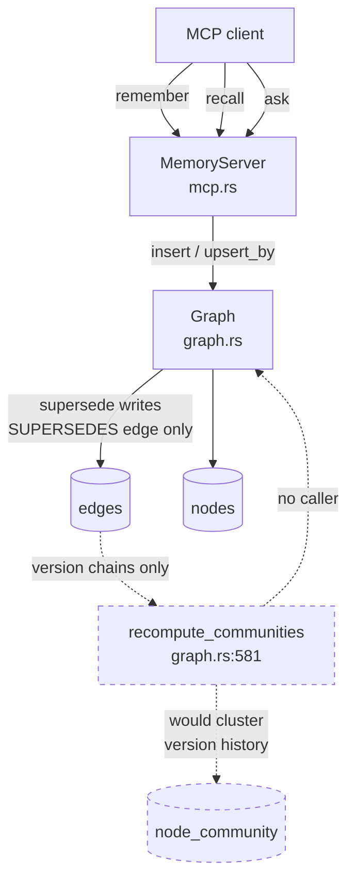
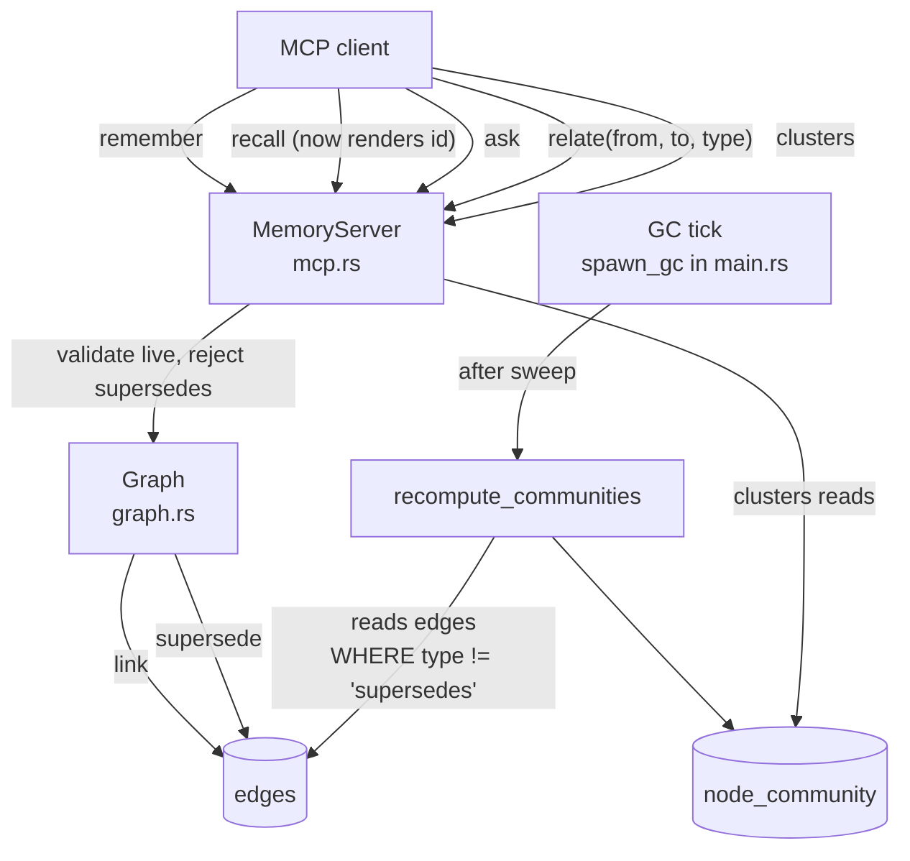
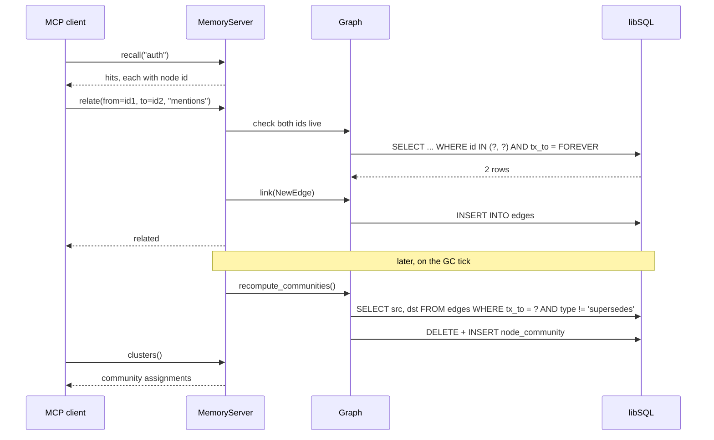

# ADR-0001: Assert memory edges by node id

- **Status:** Accepted
- **Date created:** 2026-08-17
- **Date modified:** 2026-08-19

## Context

LIAM stores memories as nodes in a bitemporal graph and fuses full-text, vector, and graph
signals at retrieval. The graph half of that has never carried real data, because no client
can create a relationship.

The MCP surface is three tools: `remember`, `recall`, `ask`
(`crates/liam-daemon/src/mcp.rs:238`, `:260`, `:286`). None asserts an edge. `Graph::link`
(`crates/liam-store/src/graph.rs:170`) exists but has no caller outside tests: its five call
sites (`graph.rs:792`, `:829`, `:1052`, `:1430`, `:1434`) all sit inside `mod tests`, which
begins at `graph.rs:694`.

The one edge production does write is structural. `Graph::supersede` (`graph.rs:130`) inserts
an edge of type `relation::SUPERSEDES` (`crates/liam-store/src/types.rs:18`) at `graph.rs:146`,
inside the same `execute_atomic` transaction that closes the old node. `remember` reaches it
through `upsert_by` whenever an argument carries a subject. So a mature store holds version
chains and nothing else.

That has a downstream consequence. `Graph::recompute_communities` (`graph.rs:581`) builds its
graph from `"SELECT src, dst FROM edges WHERE tx_to = ?1"` (`graph.rs:591`) with no filter on
`type`. Run today, Leiden would return one community per version chain of a single fact, and
every node never superseded would receive no community at all, because the node list is built
only from edge endpoints. The semantic relation `mentions` exists as a constant
(`types.rs:20`) and is never written.

Three properties of the current code decide how edges can safely be asserted:

- `Hit` carries `id` (`types.rs:243`), but `recall` renders only
  `format!("[{}] {}\n{}", hits[i].kind, hits[i].label, hits[i].content)` (`mcp.rs:279`).
  The id is dropped, so an agent can link what it just wrote (`remember` returns the id at
  `mcp.rs:255`) but cannot link what it recalled.
- `NodeId::from_raw` (`crates/liam-store/src/ids.rs:37`, from `branded_id!`) takes
  `impl Into<String>` and validates nothing.
- The declared foreign keys are not enforced. `schema.rs:58` and `:59` declare
  `src`/`dst` as `REFERENCES nodes(id)`, but SQLite disables enforcement by default and no
  `PRAGMA foreign_keys = ON` exists anywhere in `crates/liam-store/src/`.

Edge assertion is already recorded as M2.6 scope in the multi-consumer amendment, which lists
`remember` as dropping `attributes`, `valid_from`, `confidence`, edge assertion, and read-side
`as_of`/`half_life`. This decision pulls the edge-assertion piece forward so that the M5
clusters work has something real to cluster.

## Decision Drivers

- **Clustering is inert without semantic edges.** With only `supersedes` in the table,
  `recompute_communities` (`graph.rs:591`) produces version chains labelled as topics.
- **The addressing scheme is a public contract.** Two consumers will build against it: the
  coding agent and ai-notetaker. M2.6 extends the same surface further, so the shape set here
  propagates.
- **Nothing validates a node id.** `NodeId::from_raw` (`ids.rs:37`) accepts any string and the
  schema's REFERENCES are unenforced, so whatever surface accepts an id must check it or
  write dangling edges silently.
- **An agent cannot currently name what it recalled.** `recall` drops the id at `mcp.rs:279`,
  which rules out any id-addressed scheme unless that changes.
- **`supersedes` must stay unforgeable.** It is written only inside `supersede`'s atomic
  transaction (`graph.rs:146`); a client able to assert it could corrupt version history.

## Considered Alternatives

### Address edges by node id, and render ids on recall (effort: M)

- New `relate(from, to, type)` MCP tool. `recall` gains the node id in its per-hit rendering.
  `relate` validates both ids exist and are live, and rejects `supersedes`.
- Trade-offs: ids are unambiguous and already carried on `Hit`, so exposing one is a
  rendering change rather than a data change. Requires a new store method for the liveness
  check, since `Graph` has no `get` or `exists`. Changes `recall`'s output but not `ask`'s:
  the two share `build_query` and the store, not rendering, and `ask::Evidence::from_hit`
  (`crates/liam-daemon/src/ask.rs:51`) never reads `Hit::id`.

### Link at write time by subject (effort: S)

- Extend `remember` with an optional list of related subjects, resolved to ids server-side
  through `find_live_by_subject` (`crates/liam-store/src/graph.rs:465`, currently private),
  the same path `upsert_by` already uses.
- Trade-offs: smallest surface, no new tool, no change to `recall`. But
  relationships can only be expressed at the moment of writing. An agent that recalls two
  existing memories and notices a connection has no way to record it, which is precisely the
  case clustering feeds on. Subjects are also optional on nodes, so anything written without
  one is unlinkable forever.

### Address edges by label or subject (effort: M)

- New `relate` tool keyed on the human-readable label or subject already shown by `recall`.
- Trade-offs: no change to `recall`'s output, and the calls read naturally.
  But labels carry no uniqueness constraint: `nodes` declares `label TEXT NOT NULL`
  (`crates/liam-store/src/schema.rs:16`) and the table's only `UNIQUE` is on `id`
  (`schema.rs:14`). So the server must disambiguate by guessing. A wrong guess writes a
  plausible edge between the wrong pair, indistinguishable afterwards from a correct one, and
  surfacing only as a nonsense cluster much later.

### Derive the graph from embedding similarity instead (effort: L)

- Skip client-asserted edges. Build a k-nearest-neighbour graph from stored embeddings using
  `Backend::vector_search` (`crates/liam-store/src/backend.rs:71`, implemented at
  `crates/liam-store/src/backends/libsql.rs:293` over `vector_distance_cos`), and run Leiden
  on that.
- Trade-offs: works today with no edge writer and no contract change, and would cluster the
  whole store rather than only linked parts. But it infers relationships rather than recording
  them, so the graph carries no provenance and cannot be corrected by a client that knows
  better. It also makes cluster quality a function of embedder quality, and the default build
  ships a mock embedder producing random vectors.

## Decision

Adopt **address edges by node id, and render ids on recall**.

A new `relate` tool takes two node ids and a relation type. `recall` renders each hit's id.
`relate` rejects `supersedes` and validates that both endpoints exist and are live, which
requires a new store method because none exists today and the database will not do it
(`schema.rs:58`, no `foreign_keys` pragma).

Ids are the only identifier in the system guaranteed unique, already minted by
`branded_id!` (`ids.rs:34`) and already carried on `Hit` (`types.rs:243`). Every other
candidate handle is either absent, optional, or ambiguous.

**Link at write time by subject** was rejected because it cannot express a relationship
between two memories that already exist. That is the main source of the edges clustering
needs, and the limitation is structural rather than an implementation gap. Subjects being
optional makes it worse: any node written without one could never be linked.

**Address by label or subject** was rejected because the schema places no uniqueness
constraint on either, so the server would resolve ambiguity by guessing. The failure is
silent and permanent: a wrong edge is indistinguishable from a right one after the write, and
the only symptom is a cluster that looks odd months later. Trading a one-line rendering change
for permanent ambiguity in stored data is a bad exchange.

**Derive from embedding similarity** was rejected because it records no provenance. An
inferred edge cannot be asserted, corrected, or explained by the client that knows the real
relationship, and it makes clustering quality depend on the embedder, which is mock by default.
It remains a reasonable future addition alongside asserted edges, not a replacement for them.

Clustering changes follow from the decision rather than standing alone: `recompute_communities`
filters `supersedes` out of the graph it builds, the `cluster` Cargo feature is deleted so
clustering exists in every build, the recompute runs on the existing GC tick, and a `clusters`
tool exposes assignments.

## Consequences

**Positive**

- The graph channel in retrieval carries real data for the first time, and `Graph::neighbors`
  (`graph.rs:353`) starts contributing to RRF fusion on real stores rather than only in tests.
- Community detection becomes meaningful, unblocking the M5 clusters work.
- The first slice of M2.6's non-lossy ingest surface lands, with the addressing question
  settled for the rest of it.
- `relate`'s validation gives the codebase its first explicit node-existence check, which the
  unenforced foreign keys have been silently doing without.

**Negative**

- `recall`'s output format changes, for every client, permanently. The blast radius is
  narrower than it looks: `recall` renders at `crates/liam-daemon/src/mcp.rs:279` while `ask`
  builds `ask::Evidence::from_hit` (`crates/liam-daemon/src/ask.rs:51`) from `kind`, `label`,
  `content`, and `valid_from_ms`, never touching `Hit::id`. Since the grounding eval drives
  `ask` (`crates/liam-daemon/src/eval.rs:470`), its 6/6 with 0 retrieval misses cannot regress
  from this change alone. Re-running it stays a release check; it is not the gate this
  decision turns on. Putting ids into `ask`'s evidence would be a separate decision with real
  eval risk, and this record does not take it.
- Nodes with no edges get no community at all. `recompute_communities` builds its node list
  from the endpoints its own query returns (`graph.rs:591`), so `clusters` reports on the
  linked subset only, and filtering `supersedes` shrinks that subset further: a node whose
  only edge is a version link drops out entirely. Cluster coverage therefore starts empty and
  grows only as clients call `relate`.
- Deleting the `cluster` feature makes `leiden-rs` non-optional. That is the approved intent
  and it removes the option of a build without it.
- The community recompute is full, over the whole edge graph, on every GC tick. Sound now,
  unbounded later, and no measurement exists at any size.
- `relate` accepts arbitrary relation types beyond the rejected `supersedes`, with no dedup,
  so clients can write junk that pollutes clusters.

**Follow-up**

- Whether to constrain relation types to a known set is deferred; `mentions` (`types.rs:20`)
  is the only semantic constant today.
- Turning on `PRAGMA foreign_keys` is deliberately not part of this decision. It would begin
  enforcing every declared constraint at once against databases that may already contain
  violating rows, so it needs its own record and a migration story.
- Inline cluster labels on recall hits, which the 2026-07-23 design wanted, are deferred to
  avoid compounding the output-format change in one release.

## Architecture Diagrams

### Current state

### Proposed state

### Asserting and clustering an edge

