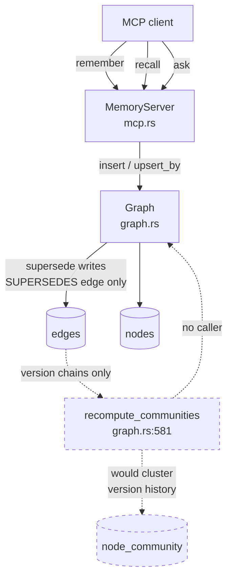
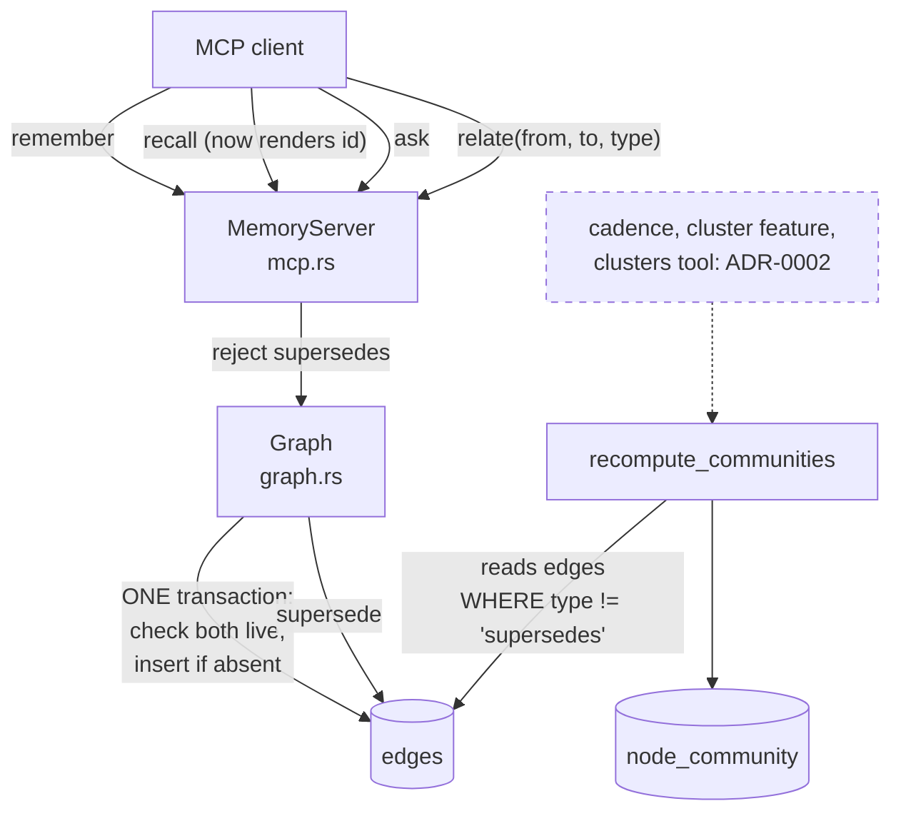
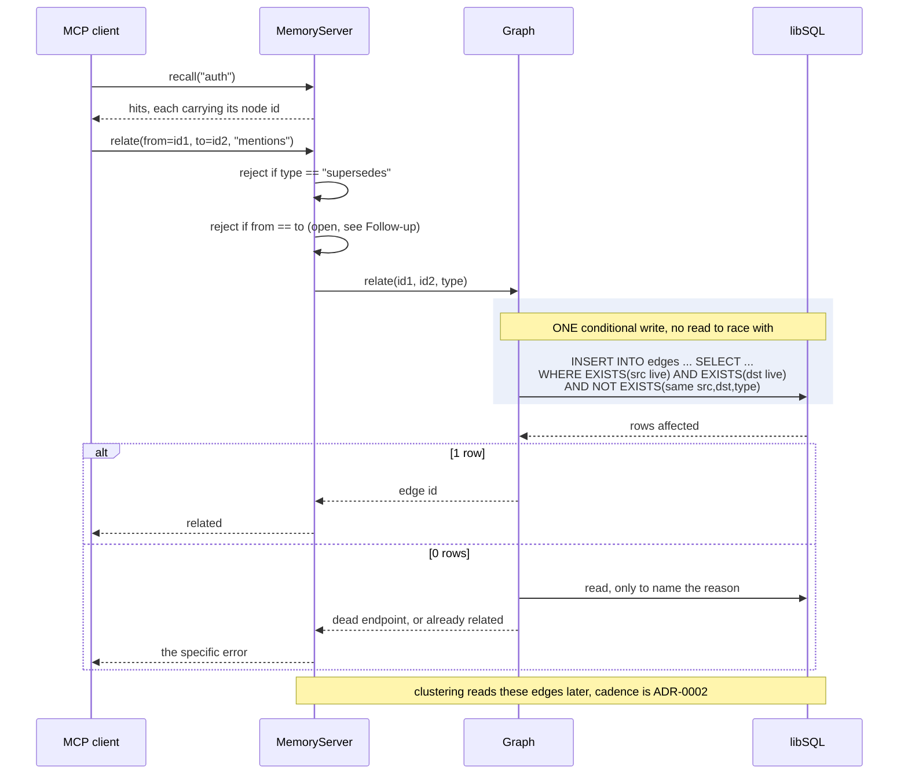

# ADR-0001: Assert memory edges by node id

- **Status:** Accepted
- **Date created:** 2026-08-17
- **Date modified:** 2026-08-20
- **Supersedes scope:** the clustering cadence, the `cluster` Cargo feature, and the
  `clusters` tool moved to [ADR-0002](0002-cluster-recompute-cadence.md) on 2026-08-20, after
  an adversarial review found them bundled here without any alternatives weighed.

## Context

LIAM stores memories as nodes in a bitemporal graph and fuses full-text, vector, and graph
signals at retrieval. The graph half of that has never carried real data, because no client
can create a relationship.

The MCP surface is three tools: `remember`, `recall`, `ask`
(`crates/liam-daemon/src/mcp.rs:238`, `:260`, `:286`). None asserts an edge. `Graph::link`
(`crates/liam-store/src/graph.rs:170`) exists but has no caller outside tests: its five call
sites (`graph.rs:792`, `:829`, `:1052`, `:1430`, `:1434`) all sit inside `mod tests`, which
begins at `graph.rs:694`.

The one edge production does write is structural. `Graph::supersede` (`graph.rs:130`) inserts
an edge of type `relation::SUPERSEDES` (`crates/liam-store/src/types.rs:18`) at `graph.rs:146`,
inside the same `execute_atomic` transaction that closes the old node. `remember` reaches it
through `upsert_by` whenever an argument carries a subject. So a mature store holds version
chains and nothing else.

That has a downstream consequence. `Graph::recompute_communities` (`graph.rs:581`) builds its
graph from `"SELECT src, dst FROM edges WHERE tx_to = ?1"` (`graph.rs:591`) with no filter on
`type`. Two things follow, and they differ in how well established they are. **Confirmed** by
the code and by the existing test `communities_separate_two_disconnected_groups_of_nodes`
(`graph.rs:1406`): a node never touched by a live edge receives no community at all, because
the node list is built only from edge endpoints. **Inferred, and covered by no test:** run
today, Leiden would most likely group each version chain into its own community, so the output
would read as topics while actually describing version history. No test exercises a
path-shaped chain, so the second belongs in this record as motivation, not as measurement.
The semantic relation `mentions` exists as a constant (`types.rs:20`) and is never written.

Three properties of the current code decide how edges can safely be asserted:

- `Hit` carries `id` (`types.rs:243`), but `recall` renders only
  `format!("[{}] {}\n{}", hits[i].kind, hits[i].label, hits[i].content)` (`mcp.rs:279`).
  The id is dropped, so an agent can link what it just wrote (`remember` returns the id at
  `mcp.rs:255`) but cannot link what it recalled.
- `NodeId::from_raw` (`crates/liam-store/src/ids.rs:37`, from `branded_id!`) takes
  `impl Into<String>` and validates nothing.
- The declared foreign keys are not enforced. `schema.rs:58` and `:59` declare
  `src`/`dst` as `REFERENCES nodes(id)`, but SQLite disables enforcement by default and no
  `PRAGMA foreign_keys = ON` exists anywhere in `crates/liam-store/src/`.

Edge assertion is already recorded as M2.6 scope in the multi-consumer amendment, which lists
`remember` as dropping `attributes`, `valid_from`, `confidence`, edge assertion, and read-side
`as_of`/`half_life`. This decision pulls the edge-assertion piece forward so that the M5
clusters work has something real to cluster.

## Decision Drivers

- **Clustering is inert without semantic edges.** With only `supersedes` in the table, the
  only nodes `recompute_communities` (`graph.rs:591`) can assign at all are those sitting on a
  version chain; every other node is invisible to it. That much is confirmed. Whether Leiden
  additionally splits those chains one per community is inferred, not measured.
- **The addressing scheme is a public contract.** Two consumers will build against it: the
  coding agent and ai-notetaker. M2.6 extends the same surface further, so the shape set here
  propagates.
- **Nothing validates a node id.** `NodeId::from_raw` (`ids.rs:37`) accepts any string and the
  schema's REFERENCES are unenforced, so whatever surface accepts an id must check it or
  write dangling edges silently.
- **An agent cannot currently name what it recalled.** `recall` drops the id at `mcp.rs:279`,
  which rules out any id-addressed scheme unless that changes.
- **`supersedes` must stay unforgeable.** It is written only inside `supersede`'s atomic
  transaction (`graph.rs:146`); a client able to assert it could corrupt version history.

## Considered Alternatives

### Address edges by node id, and render ids on recall (effort: M)

- New `relate(from, to, type)` MCP tool. `recall` gains the node id in its per-hit rendering.
  `relate` validates both ids exist and are live, and rejects `supersedes`.
- Trade-offs: ids are unambiguous and already carried on `Hit`, so exposing one is a
  rendering change rather than a data change. Requires a new store method for the liveness
  check, since `Graph` has no `get` or `exists`. Changes `recall`'s output but not `ask`'s:
  the two share `build_query` and the store, not rendering, and `ask::Evidence::from_hit`
  (`crates/liam-daemon/src/ask.rs:51`) never reads `Hit::id`.

### Link at write time by subject (effort: S)

- Extend `remember` with an optional list of related subjects, resolved to ids server-side
  through `find_live_by_subject` (`crates/liam-store/src/graph.rs:465`, currently private),
  the same path `upsert_by` already uses.
- Trade-offs: smallest surface, no new tool, no change to `recall`. But
  relationships can only be expressed at the moment of writing. An agent that recalls two
  existing memories and notices a connection has no way to record it, which is precisely the
  case clustering feeds on. Subjects are also optional on nodes, so anything written without
  one is unlinkable forever.
- A variant, **link at write time by id**, avoids the ambiguity that sinks the subject and
  label schemes, since ids are unique. It is not an alternative to `relate` and could not
  replace it, because it still cannot express a link between two memories that already exist,
  which is the case this record exists to serve. It is a possible later convenience on top of
  the chosen design, reusing the same liveness check, and is noted here so a future reader
  sees it was considered rather than missed.

### Address edges by label or subject (effort: M)

- New `relate` tool keyed on the human-readable label or subject already shown by `recall`.
- Trade-offs: no change to `recall`'s output, and the calls read naturally.
  But labels carry no uniqueness constraint: `nodes` declares `label TEXT NOT NULL`
  (`crates/liam-store/src/schema.rs:16`) and the table's only `UNIQUE` is on `id`
  (`schema.rs:14`). So the server must disambiguate by guessing. A wrong guess writes a
  plausible edge between the wrong pair, indistinguishable afterwards from a correct one, and
  surfacing only as a nonsense cluster much later.

### Derive the graph from embedding similarity instead (effort: L)

- Skip client-asserted edges. Build a k-nearest-neighbour graph from stored embeddings using
  `Backend::vector_search` (`crates/liam-store/src/backend.rs:71`, implemented at
  `crates/liam-store/src/backends/libsql.rs:293` over `vector_distance_cos`), and run Leiden
  on that.
- Trade-offs: works today with no edge writer and no contract change, and would cluster the
  whole store rather than only linked parts. But it infers relationships rather than recording
  them, so the graph carries no provenance and cannot be corrected by a client that knows
  better. It also makes cluster quality a function of embedder quality, and the default build
  ships a mock embedder producing random vectors.

## Decision

Adopt **address edges by node id, and render ids on recall**.

A new `relate` tool takes two node ids and a relation type. `recall` renders each hit's id.
`relate` rejects `supersedes` and validates that both endpoints exist and are live, which
requires a new store method because none exists today and the database will not do it
(`schema.rs:58`, no `foreign_keys` pragma).

**Liveness and idempotency are enforced inside the write statement, not by a check before
it.** Both requirements are real. An edge must not point at a node that is no longer live,
which is the guarantee the unenforced foreign keys were supposed to provide. And a repeated
assertion must not write a second row: `cluster.rs:11` documents that "A repeated pair raises
weight", and `detect` calls `builder.add_edge(u, v, 1.0)` once per row, so duplicate rows do
not merely clutter the table, they weight the graph Leiden reads.

The obvious shape, check first and insert afterwards, is a time-of-check-to-time-of-use race:
a concurrent `supersede` closes an endpoint in between and the edge still lands. Less
obviously, **the fix is not "do both inside `execute_atomic`".** That method takes a statement
list built before the call and returns `Result<()>` (`crates/liam-store/src/backend.rs:53`),
and the libSQL implementation runs each statement with `execute` rather than `query`
(`crates/liam-store/src/backends/libsql.rs:247`). Nothing inside that transaction can read a
row and branch on it. `supersede` is not a precedent for it either: its `exists_as_of` check
runs before the transaction is built (`graph.rs:132`), and the real race guard is the
`WHERE id = ?2 AND tx_to = ?3` clause on its UPDATE (`graph.rs:141`), a conditional write that
becomes a no-op if the row already moved.

So `relate` applies that same principle: one conditional write, guarded by its own `WHERE`.

```sql
INSERT INTO edges (id, src, dst, type, attributes, tx_from, tx_to)
SELECT ?1, ?2, ?3, ?4, '{}', ?5, ?6
WHERE EXISTS     (SELECT 1 FROM nodes WHERE id = ?2 AND tx_to = ?7)
  AND EXISTS     (SELECT 1 FROM nodes WHERE id = ?3 AND tx_to = ?7)
  AND NOT EXISTS (SELECT 1 FROM edges
                  WHERE src = ?2 AND dst = ?3 AND type = ?4 AND tx_to = ?7)
```

A single statement is atomic by itself, so this needs no new `Backend` capability. `execute`
returns the affected row count, so zero means the write was refused, and `relate` can then
issue a plain read purely to tell the client which condition failed. That follow-up read
races nothing, because it only shapes an error message and never decides whether to write.

Idempotency rests on `NOT EXISTS` rather than on a unique constraint deliberately: `edges`
declares only `id` as PRIMARY KEY and both its indexes are non-unique (`schema.rs:56`, `:66`,
`:67`), so `INSERT OR IGNORE` would have nothing to ignore, and adding a UNIQUE index would be
a migration against stores that may already contain duplicate rows.

Ids are the only identifier in the system guaranteed unique, already minted by
`branded_id!` (`ids.rs:34`) and already carried on `Hit` (`types.rs:243`). Every other
candidate handle is either absent, optional, or ambiguous.

**Link at write time by subject** was rejected because it cannot express a relationship
between two memories that already exist. That is the main source of the edges clustering
needs, and the limitation is structural rather than an implementation gap. Subjects being
optional makes it worse: any node written without one could never be linked.

**Address by label or subject** was rejected because the schema places no uniqueness
constraint on either, so the server would resolve ambiguity by guessing. The failure is
silent and permanent: a wrong edge is indistinguishable from a right one after the write, and
the only symptom is a cluster that looks odd months later. Trading a one-line rendering change
for permanent ambiguity in stored data is a bad exchange.

**Derive from embedding similarity** was rejected because it records no provenance. An
inferred edge cannot be asserted, corrected, or explained by the client that knows the real
relationship, and it makes clustering quality depend on the embedder, which is mock by default.
It remains a reasonable future addition alongside asserted edges, not a replacement for them.

### Scope

One clustering change belongs here, because it follows directly from the addressing decision:
`recompute_communities` filters `supersedes` out of the graph it builds (`graph.rs:591`). If
`relate` refuses to assert `supersedes` on the grounds that it is structural rather than
semantic, then the clustering read side cannot keep treating it as semantic. That is the same
decision seen from the other end.

Three further changes were originally bundled into this record and have been **moved out to
ADR-0002**: deleting the `cluster` Cargo feature, running the recompute on the GC tick, and
adding a `clusters` tool. None of them answers "how are edges addressed", none had any
alternatives weighed against it here, and the cadence question in particular deserves a real
comparison this record never made. `changes_since` (`graph.rs:516`) already exists and is
documented for "incremental work (rebuild only new vectors, recompute only changed
communities)", yet the bundled plan was a full unfiltered scan on a six-hourly tick
(`config.rs:153`). Choosing between those is its own decision with its own trade-offs, and
burying it in a record about addressing would have let it ship unargued.

## Consequences

**Positive**

- The graph channel in retrieval carries real data for the first time, and `Graph::neighbors`
  (`graph.rs:353`) starts contributing to RRF fusion on real stores rather than only in tests.
- Community detection becomes meaningful, unblocking the M5 clusters work.
- The first slice of M2.6's non-lossy ingest surface lands, with the addressing question
  settled for the rest of it.
- `relate`'s validation gives the codebase its first explicit node-existence check, which the
  unenforced foreign keys have been silently doing without.

**Negative**

- `recall`'s output format changes, for every client, permanently. The blast radius is
  narrower than it looks: `recall` renders at `crates/liam-daemon/src/mcp.rs:279` while `ask`
  builds `ask::Evidence::from_hit` (`crates/liam-daemon/src/ask.rs:51`) from `kind`, `label`,
  `content`, and `valid_from_ms`, never touching `Hit::id`. Since the grounding eval drives
  `ask` (`crates/liam-daemon/src/eval.rs:470`), its 6/6 with 0 retrieval misses cannot regress
  from this change alone. Re-running it stays a release check; it is not the gate this
  decision turns on. Putting ids into `ask`'s evidence would be a separate decision with real
  eval risk, and this record does not take it.
- Nodes with no edges get no community at all. `recompute_communities` builds its node list
  from the endpoints its own query returns (`graph.rs:591`), so community assignment covers
  the linked subset only, and the `supersedes` filter shrinks that subset further: a node
  whose only edge is a version link drops out entirely. Coverage therefore starts empty on
  every existing store and grows only as clients call `relate`. Anything built on top of
  community assignments has to treat "no community" as the normal case, not an error.
- `relate` accepts any relation type string except the rejected `supersedes`, and the
  clustering read side excludes only `supersedes` too. So a junk type contributes to community
  detection exactly as much as `mentions` does. Idempotency (above) stops a client inflating
  one pair's weight by repetition, but it does nothing about a client inventing types. This is
  the weakest part of the decision: it trades "clustering is inert" for "clustering follows
  whatever types clients send", which is better but not obviously good. Constraining the type
  set is deferred below, and that deferral is a real risk rather than a formality.
- Exposing raw node ids makes an internal identifier part of the client contract. Ids become
  something clients may store, log, and send back, which constrains any future change to
  `NodeId` (`ids.rs:34`).
- **An asserted edge outlives the liveness of its endpoints.** `relate` refuses to create an
  edge to a node that is not live, but `supersede` closes only the node row: its statement list
  updates `nodes` and inserts the new node and the `SUPERSEDES` edge (`graph.rs:139`), and
  never touches the superseded node's other edges. A `mentions` edge asserted while both ends
  were live therefore stays `tx_to = FOREVER` and keeps contributing to clustering after one
  endpoint has been superseded, until `gc` removes the node and sweeps the orphan
  (`graph.rs:558`). The asymmetry is deliberate rather than overlooked: closing an edge on
  supersession would silently erase a relationship the client asserted about a fact whose
  latest version still exists. It is recorded here so the blueprint does not "fix" it by
  accident.

**Follow-up**

- Whether to constrain relation types to a known set is deferred; `mentions` (`types.rs:20`)
  is the only semantic constant today. Deferring it is what leaves the arbitrary-type risk in
  Consequences open, so it should be settled before, or together with, the clustering cadence
  in ADR-0002 rather than drifting indefinitely.
- **How the id appears in `recall`'s output is deliberately not fixed here.** This record
  settles that recall must expose the id, not the shape it takes. `recall` currently returns
  one flat human-readable string per hit (`mcp.rs:279`), so the choice between a prefix, a
  trailing field, or a structured response is a formatting decision for the execution
  blueprint. It is called out because leaving it implicit invites it to be invented during
  implementation and never reviewed.
- Whether `relate` should reject a self-loop (`from == to`) is unresolved. Leiden tolerates
  one, but it carries no meaning and is most likely a client bug worth reporting back.
- Turning on `PRAGMA foreign_keys` is deliberately not part of this decision. It would begin
  enforcing every declared constraint at once against databases that may already contain
  violating rows, so it needs its own record and a migration story.
- Inline cluster labels on recall hits, which the 2026-07-23 design wanted, are deferred to
  avoid compounding the output-format change in one release.

## Architecture Diagrams

### Current state



### Proposed state



### Asserting an edge

There is no separate check step. Liveness and idempotency are conditions on the single INSERT,
so a concurrent `supersede` cannot slip between a check and a write. The read after a refusal
exists only to explain which condition failed.


