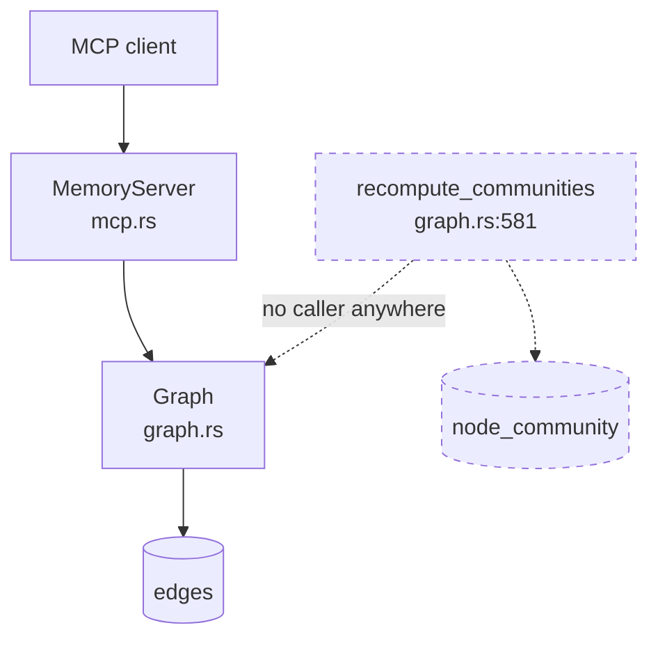
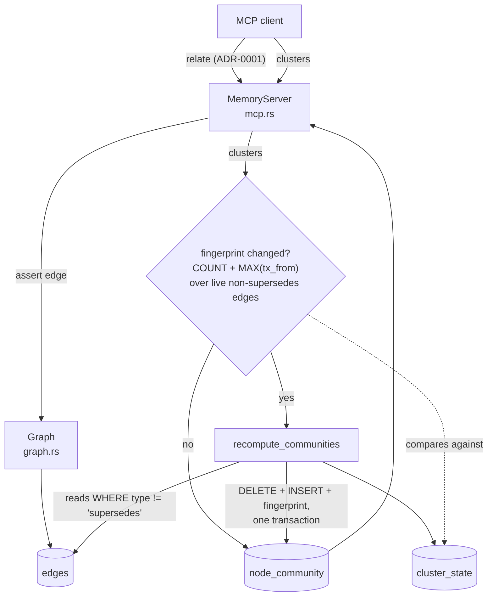
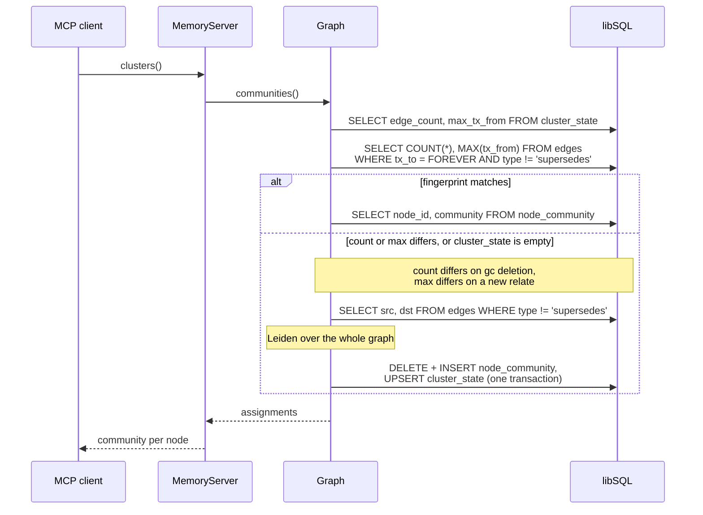

# ADR-0002: Recompute clusters lazily on read, not on a timer

- **Status:** Proposed
- **Date created:** 2026-08-20
- **Date modified:** 2026-08-20
- **Split from:** [ADR-0001](0001-assert-memory-edges-by-node-id.md), which bundled these
  changes into the addressing decision with no alternatives weighed. An adversarial review
  flagged the bundling, and separating it immediately surfaced that the obvious incremental
  option does not actually exist (see **Incremental recompute** below).

## Context

ADR-0001 gives clients a way to assert edges, so community detection finally has something
real to work on. It deliberately leaves three questions open, and they are all one question:
**when does clustering run, and who can see it?**

`Graph::recompute_communities` (`crates/liam-store/src/graph.rs:581`) has no caller anywhere
in production. It reads every live edge, runs Leiden over the whole graph, then replaces the
entire assignment table inside one transaction: a `DELETE FROM node_community` followed by one
`INSERT` per node (`graph.rs:603-616`). There is no partial update path. It is all or nothing,
by construction.

Three properties of the current code constrain the answer:

- **Clustering is a whole-graph algorithm as built.** `cluster::detect`
  (`crates/liam-store/src/cluster.rs:15`) takes a node count and a full edge list, builds a
  `GraphDataBuilder`, and runs Leiden across it. There is no incremental entry point, so
  "recompute part of it" is not a smaller version of the same call.
- **No cursor can see an edge write.** `changes_since` (`graph.rs:516`) is documented "for
  incremental work (rebuild only new vectors, recompute only changed communities)", but its
  query is `SELECT id, tx_from, tx_to FROM nodes` and `Change` (`types.rs:268`) carries only a
  node id, a timestamp, and a closed flag. A `relate` call inserts into `edges` and touches no
  node row, so this cursor returns nothing for exactly the event that changes communities. The
  doc comment describes an intent the implementation does not support.
- **`node_community` already records when it was computed.** The insert at `graph.rs:607`
  writes a `computed_at` column, so staleness is answerable from the database without keeping
  any in-memory state.

The `cluster` Cargo feature (`crates/liam-store/Cargo.toml:39`) is on by default and gates all
of the above.

## Decision Drivers

- **Nothing reads clusters today.** Work done on a timer for a consumer that may never call is
  pure waste, and it is waste that grows with the store.
- **No measurement exists at any size.** Neither the original bundled plan nor this record can
  point at a benchmark. Whatever is chosen must degrade visibly rather than silently.
- **Staleness is a correctness property here.** A cluster assignment that predates the edge a
  user just asserted is wrong in the way most likely to be noticed, because the user asserted
  that edge specifically to affect grouping.
- **The daemon is local-first and single-user.** There is no fleet to amortise background work
  across, and the process may be launched on demand by launchd rather than run continuously,
  so a six-hourly timer may simply never fire (`packaging/dev.protocortex.liamd.plist`
  declares no `KeepAlive`).

## Considered Alternatives

### Recompute on the GC tick (effort: S)

- Call `recompute_communities` from `spawn_gc` after each sweep, on the existing
  `gc.interval_hours` schedule, which defaults to 6 (`crates/liam-daemon/src/config.rs:153`).
- Trade-offs: trivial to wire, and the tick already exists. But it does full-graph work on a
  timer regardless of whether anything ever reads the result; it leaves an assignment up to six
  hours stale, so an edge asserted now is invisible until the next tick; and under the launchd
  job, which declares no `KeepAlive`, a short-lived daemon may exit before a tick ever fires,
  making clusters permanently empty rather than merely stale. This was the option bundled into
  ADR-0001 and never compared against anything.

### Recompute on every `relate` (effort: S)

- Trigger the recompute from the write path, so the assignment is never stale.
- Trade-offs: always fresh. But an agent asserting a batch of twenty edges pays for twenty
  full-graph Leiden runs, nineteen of which are immediately superseded, and it puts unbounded
  work inside a tool call the client is waiting on. Debouncing it turns this back into a timer
  with extra steps.

### Incremental recompute from a change cursor (effort: L, and not currently possible)

- Track what changed since the last run and reassign only the affected part of the graph.
- Trade-offs: this is the option that sounds obviously right and is not available. It needs two
  things the codebase does not have. First, a cursor that observes edge writes: `changes_since`
  (`graph.rs:516`) reads the `nodes` table only, so it cannot see a `relate`. Second, an
  incremental Leiden: `cluster::detect` (`cluster.rs:15`) runs over a whole `GraphDataBuilder`
  and `leiden-rs` exposes no partial-update entry point. Community membership is also global by
  nature, since adding one edge can merge two communities far from it. Worth revisiting only
  when a measurement shows the full recompute actually hurts.

### Recompute lazily on read, gated by a staleness check (effort: M)

- The `clusters` tool compares a cheap fingerprint of the clustering-relevant edge set against
  the fingerprint recorded when the assignment was last computed, and recomputes only on a
  mismatch. Otherwise it serves what is already in `node_community`.
- Trade-offs: no work is ever done for a result nobody reads, and a reader never sees a stale
  assignment. The cost lands as latency on the `clusters` call, bounded by store size, on a
  caller explicitly asking for clustering. The fingerprint must itself be cheap, and the first
  call after a burst of writes pays the full cost.
- **A timestamp alone is not a sound fingerprint, which is the trap this option has to avoid.**
  The obvious signal, "is any live edge newer than `computed_at`", silently misses deletion.
  `gc` hard-deletes edges (`graph.rs:555`:
  `DELETE FROM edges WHERE src NOT IN (SELECT id FROM nodes) OR dst NOT IN (...)`), so after a
  sweep `MAX(tx_from)` over live edges can only stay equal or fall. An assignment computed
  before a gc would keep reporting itself current while describing edges that no longer exist,
  potentially holding two groups merged that are now disconnected.

## Decision

Adopt **recompute lazily on read, gated by a staleness check**.

The `clusters` tool computes a fingerprint of the edge set clustering actually reads, namely
`SELECT COUNT(*), MAX(tx_from) FROM edges WHERE tx_to = FOREVER AND type != 'supersedes'`, and
compares it against the fingerprint stored when the assignment was last written. On a mismatch
it recomputes before answering; otherwise it serves `node_community` as it stands.

Both parts are load-bearing:

- `MAX(tx_from)` catches **insertion**, which is what `relate` does.
- `COUNT(*)` catches **deletion**, which a timestamp cannot, because `gc` hard-deletes edges
  (`graph.rs:555`) and deletion never advances a maximum. An insert and a delete inside the
  same window leaves the count unchanged but still advances the maximum, since the new row is
  newer than the recorded fingerprint, so the pair covers that case too.
- Filtering `type != 'supersedes'` keeps the fingerprint aligned with the graph clustering
  reads. Without it every `supersede` would invalidate an assignment it cannot possibly affect,
  turning ordinary `remember` traffic into repeated Leiden runs.

Storing the fingerprint needs somewhere to put it: `node_community` holds only `node_id`,
`community`, and `computed_at` (`graph.rs:607`), and the value is a property of the run, not of
any one node. So this adds a single-row `cluster_state` table carrying the computed-at
timestamp, the edge count, and the max `tx_from`, written in the same transaction that replaces
the assignment.

Keeping that state in the database rather than an in-memory dirty flag matters because launchd
can start and stop the daemon at will: an in-process flag is lost on every restart and would
have to assume dirty, which is indistinguishable from recomputing on every call.

**Recompute on the GC tick** was rejected because it does full-graph work for a consumer that
may never call, and because the launchd job declares no `KeepAlive`, so the tick that was
supposed to keep clusters fresh may never fire at all. It converts a bounded on-demand cost
into an unbounded recurring one and buys staleness in exchange.

**Recompute on every `relate`** was rejected because it puts whole-graph work inside a
client-visible write call and repeats it once per edge in a batch.

**Incremental recompute** was rejected as not currently possible rather than undesirable. It
needs an edge-aware change cursor and an incremental Leiden, neither of which exists, and the
`changes_since` doc comment that suggests otherwise is inaccurate and should be corrected.

The `cluster` Cargo feature is deleted, making `leiden-rs` a plain dependency. The feature is
already on by default (`crates/liam-store/Cargo.toml:25`), so only a build passing
`--no-default-features` is affected, and shipping a release where clustering silently does not
exist is a worse outcome than carrying the dependency.

## Consequences

**Positive**

- No clustering work is performed unless something reads clusters.
- A reader never sees an assignment older than the newest edge, which removes the staleness
  window entirely rather than shrinking it.
- Correct behaviour under an on-demand launchd job, where a periodic tick is unreliable.
- The decision stays reversible: moving to a timer later is a small change, and the staleness
  check remains useful either way.

**Negative**

- The first `clusters` call after a write burst pays the full recompute, so latency is spiky
  by design. There is still no measurement at any store size, so the size at which this becomes
  unacceptable is unknown. It must be logged with node and edge counts so the ceiling is
  discoverable from real use rather than guessed.
- One extra aggregate read on every `clusters` call, including the common case where nothing
  changed.
- A new `cluster_state` table, so this decision carries a schema migration rather than being
  pure application logic.
- The fingerprint is a heuristic, not a proof, and it has two known gaps. Both are disclosed
  here rather than discovered later.
  - **In-place mutation would defeat it.** `COUNT` plus `MAX(tx_from)` catches every edge-set
    change the current writers can produce, because the only three writers to `edges` are
    `link` (insert, `graph.rs:176`), `supersede` (insert, filtered out, `graph.rs:146`), and
    `gc` (delete, `graph.rs:558`); there is no `UPDATE edges` anywhere. A future writer that
    changed a row's `src`, `dst`, or `type` in place would move neither the count nor the max.
    Any such writer must update this contract too, and that obligation belongs in a comment
    beside the query.
  - **A same-millisecond tie can mask one change.** `Millis` is wall-clock millisecond
    resolution, so if an insert lands in the same millisecond as the edge currently holding
    the max, while a `gc` sweep removes a different edge in the same window, the count returns
    to its previous value and the max is unmoved. The window is narrow and the effect is
    self-healing: the next insert or delete that does not tie triggers a full recompute against
    the then-current edges. Worth knowing, not worth a monotonic counter at this scale.
- Deleting the `cluster` feature removes the option of a build without `leiden-rs`.
- A recompute triggered inside a read path means a read can now write, which is a new shape for
  this codebase and interacts with the single-writer-per-`Graph` caveat deferred to M3.5.
  Until M3.5 lands the interim behaviour is deliberate rather than merely acknowledged: the
  recompute takes the ordinary write path, so it serializes behind the write mutex like any
  other write (`backend.rs:16`). The fingerprint check is a read, and the same contract
  requires reads not to queue behind an in-flight write, so a `clusters` call that finds
  nothing stale never waits on a concurrent `remember`. Only a call that actually recomputes
  does, and `clusters` is an explicit, infrequent request rather than part of the `recall` or
  `ask` hot path.
- **Two concurrent `clusters` calls can both recompute.** Reads do not serialize with each
  other or with writes (`backend.rs:16`), so both callers can read the same stale fingerprint
  before either writes, and both then run Leiden. This is wasteful, not corrupting: `detect`
  is deterministically seeded (`cluster.rs`, `seed: Some(42)`), so both runs produce the same
  assignment, and each write is all-or-nothing, so the second simply overwrites the first with
  identical rows. Left unguarded on purpose, because a lock held across a full Leiden run would
  cost more than the duplicate work it prevents at any store size this design targets.
- **A failed recompute serves an error, not a stale answer.** Because `execute_atomic` is all
  or nothing (`backend.rs:50`), a failure part-way leaves the previous assignment intact rather
  than half-deleted. `clusters` must still surface the failure rather than quietly returning
  the old assignment, since silently serving stale data is the exact outcome this whole
  decision exists to prevent.

**Follow-up**

- Correct the `changes_since` doc comment (`graph.rs:516`), which promises incremental
  community recompute the query cannot support.
- Constraining relation types, deferred by ADR-0001, matters more here: clustering excludes
  only `supersedes`, so any other type a client invents contributes equally to the result.
- Whether `clusters` should expose community labels rather than opaque integers is unaddressed;
  `recompute_communities` returns a count and stores integer ids (`graph.rs:618`).

## Architecture Diagrams

### Current state

### Proposed state

### Serving a clusters call

