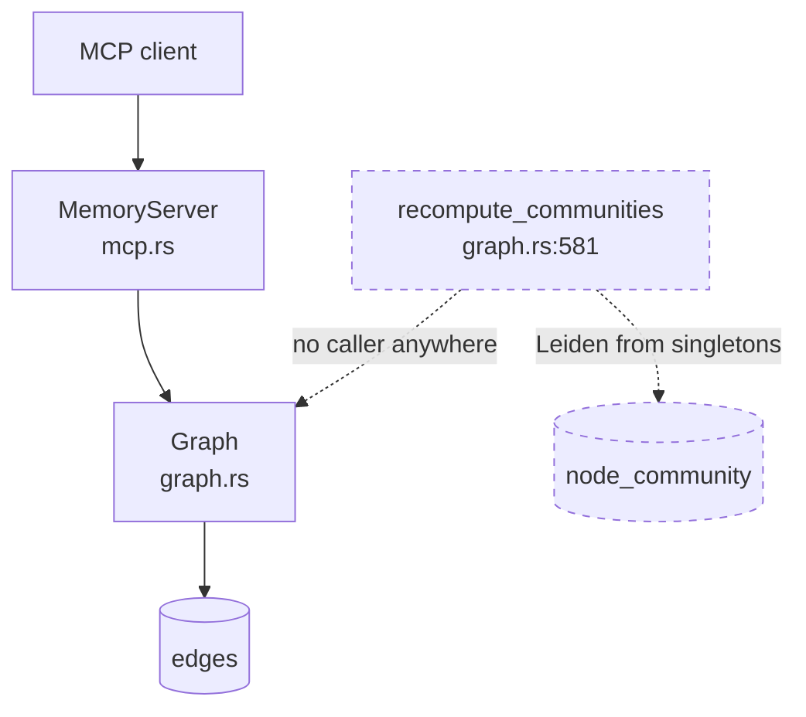
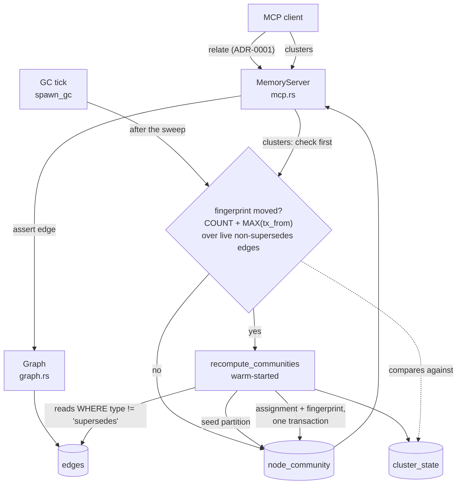
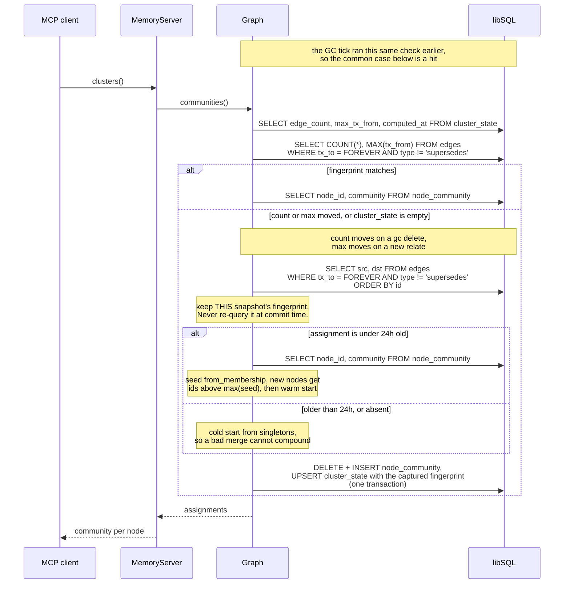

# ADR-0002: Recompute clusters on the GC tick and lazily on read, warm-started

- **Status:** Accepted
- **Date created:** 2026-08-20
- **Date modified:** 2026-08-21
- **Split from:** [ADR-0001](0001-assert-memory-edges-by-node-id.md), which bundled these
  changes into the addressing decision with no alternatives weighed. An adversarial review
  flagged the bundling, and separating it surfaced both the deletion-blind staleness signal
  and the warm-start API that this record now depends on.

## Context

ADR-0001 gives clients a way to assert edges, so community detection finally has something
real to work on. It deliberately leaves three questions open, and they are one question:
**when does clustering run, and who pays for it?**

`Graph::recompute_communities` (`crates/liam-store/src/graph.rs:581`) has no caller in
production. It reads every live edge, runs Leiden over the whole graph, then replaces the
entire assignment table in one transaction: `DELETE FROM node_community` followed by one
`INSERT` per node (`graph.rs:603-616`).

Four properties of the current code decide the answer:

- **Leiden's output is global, but it can be warm-started.** `cluster::detect`
  (`crates/liam-store/src/cluster.rs:15`) calls `Leiden::new(config).run(&graph)`, which starts
  from singletons every time. The pinned `leiden-rs` 0.8.1 also exposes
  `run_with_initial_partition(&self, data, initial_partition)` (`src/leiden.rs:478`),
  documented for "Incremental refinement after minor graph changes", with `Partition::from_membership`
  (`src/partition.rs:29`) to build the seed. This is the difference between recomputing from
  scratch and refining the previous answer. It is **not** per-node incremental: the call still
  walks the whole graph, and it requires `initial_partition.len() == data.node_count()`.
- **No cursor can see an edge write.** `changes_since` (`graph.rs:516`) is documented "for
  incremental work (rebuild only new vectors, recompute only changed communities)", but it
  queries `SELECT id, tx_from, tx_to FROM nodes` and `Change` (`types.rs:268`) carries only a
  node id, a timestamp, and a closed flag. A `relate` inserts into `edges` and touches no node
  row, so this cursor returns nothing for exactly the event that changes communities. The doc
  comment describes an intent the implementation does not support.
- **`gc` hard-deletes.** It removes expired nodes (`graph.rs:550`) and then always sweeps
  orphaned edges in the same call (`graph.rs:558`). Deletion is invisible to any
  newest-timestamp signal, because deleting rows never advances a maximum.
- **Writes serialize, reads do not** (`crates/liam-store/src/backend.rs:16`), and reads must
  not queue behind an in-flight write.

The `cluster` Cargo feature (`crates/liam-store/Cargo.toml:39`) is on by default and gates all
of the above.

## Decision Drivers

- **A read should be fast.** `clusters` is a client-facing call. The common case must not pay
  for a full Leiden run.
- **Work must not be wasted.** Nothing reads clusters today, so unconditional periodic
  recomputation burns cycles for a consumer that may never call.
- **Staleness is a correctness property here.** An assignment that predates the edge a user
  just asserted is wrong in the way most likely to be noticed, because the user asserted that
  edge precisely to affect grouping.
- **The daemon is local-first and may not run continuously.** The launchd job declares no
  `KeepAlive`, deliberately and with a comment saying so
  (`packaging/dev.protocortex.liamd.plist:96`), so a periodic tick cannot be the only
  mechanism or clusters may never be computed at all.

## Considered Alternatives

### Recompute on the GC tick only (effort: S)

- Call `recompute_communities` from `spawn_gc` after each sweep, on `gc.interval_hours`,
  default 6 (`crates/liam-daemon/src/config.rs:153`).
- Trade-offs: trivial to wire, reads are always cheap. But an edge asserted now stays invisible
  for up to six hours, which violates the staleness driver; it does full-graph work whether or
  not anything reads it; and under a job with no `KeepAlive` the daemon may exit before a tick
  fires, leaving clusters permanently empty rather than merely stale.

### Recompute lazily on read only (effort: M)

- `clusters` checks whether the edge set changed and recomputes if so, otherwise serves the
  stored assignment.
- Trade-offs: never wasted, never stale. But the first read after any write pays a full Leiden
  run, so the cost lands on the client in the least predictable way, and a store that is
  written to steadily makes almost every read a slow one.

### Recompute on every `relate` (effort: S)

- Trigger from the write path so the assignment is never stale.
- Trade-offs: always fresh, but an agent asserting twenty edges pays for twenty whole-graph
  runs, nineteen immediately superseded, inside calls the client is waiting on.

### True per-node incremental recompute (effort: L, not available)

- Reassign only the nodes whose neighbourhood changed, leaving the rest untouched.
- Trade-offs: this is the option that sounds right and cannot be built on the current stack.
  Community membership is global: adding one edge can merge two communities whose nodes are
  nowhere near it, so "only the changed nodes" is not a well-defined subproblem.
  `run_with_initial_partition` is the closest the library offers and it still walks the whole
  graph. There is also no cursor that can observe an edge write (see Context). Revisit only if
  a measurement shows a warm-started full pass is genuinely too slow.

### GC tick plus lazy read, both warm-started (effort: M)

- The tick refreshes the assignment when the edge set has changed, so the common read is a
  cache hit. The read still checks, and recomputes itself when a write landed since the tick,
  so freshness never depends on the tick having run. Both paths warm-start from the stored
  partition.
- Trade-offs: two call sites instead of one, and the tick can still do work nothing reads. In
  exchange, reads are fast in the common case and correct in every case.

## Considered alternatives for detecting change

The alternatives above weigh *when* to recompute. They take for granted *how* the system knows
anything changed, which is a separate question and was not weighed when the fingerprint was
first written. It is weighed here because the fingerprint is the weakest link in the decision.

The root problem is an asymmetry. `edges` carries `tx_from` and `tx_to` (`schema.rs:56`), the
same bitemporal columns that make `changes_since` work for nodes, but **nothing ever closes an
edge**: no `UPDATE edges` exists anywhere in the store, so `tx_to` is written once at insert and
never moves. Edge creation is therefore observable and edge removal is not, because `gc`
hard-deletes rows that were never closed (`graph.rs:558`).

### A fingerprint over the current edge set (effort: S, chosen)

- `COUNT(*)` and `MAX(tx_from)` over the clustering-relevant edges, stored per run.
- Trade-offs: no new writer discipline and no new subsystem, and it works entirely from data
  that already exists. But it is a heuristic that infers change from a summary of state rather
  than observing change itself, which is why it carries the two disclosed gaps below.

### An append-only change ledger (effort: L)

- Every writer to `edges` appends a row to a ledger (`seq`, edge id, endpoints, type, insert or
  delete) in the same transaction as its write. `cluster_state` stores the last `seq` applied,
  and staleness is the exact test `MAX(seq) > last_applied_seq`.
- Trade-offs: **this is the only option that closes both disclosed gaps.** A monotonic sequence
  is immune to the same-millisecond tie, and an in-place edge mutation would append a row rather
  than hide behind an unchanged count. It also names *which* endpoints changed, which a summary
  never can, and it can be pruned safely below the lowest applied cursor so it does not grow
  without bound. Against it: it is a cross-cutting subsystem, not a clustering feature. It adds
  a row to every edge write, and it relies on all three writers remembering to append, which is
  the same discipline the fingerprint depends on, relocated rather than removed. Its natural
  scope is larger than this record: LIAM already has a node-level change cursor in
  `changes_since` (`graph.rs:516`) whose doc comment promises incremental work it cannot
  deliver, and a second concurrent consumer is on the roadmap, so a change feed designed around
  clustering alone would be designed for the wrong requirements.

### Close edges instead of deleting them (effort: M)

- Make `gc` set `tx_to = now` on swept edges rather than `DELETE`, so edges become symmetric
  with nodes, and detect change with the same `tx_from > cursor OR tx_to > cursor` predicate
  `changes_since` already uses.
- Trade-offs: no new table and no new concept, just using the bitemporal columns the schema
  already declares for the purpose they were declared for. But it directly opposes what `gc`
  is for. Retention exists to reclaim space, and tombstones accumulate exactly the rows it was
  asked to remove, so it needs a second purge pass for closed edges past retention, at which
  point the deletion becomes invisible again and the problem returns one level down.

## Decision

Adopt **GC tick plus lazy read, both warm-started**, with the **fingerprint** as the change
signal for now.

The ledger is the better mechanism and is deliberately not adopted here. Building it inside a
record about clustering cadence would repeat the exact mistake that ADR-0001 was split to
correct: a cross-cutting subsystem, adopted with no requirements of its own, because one
consumer happened to need it first. The fingerprint is therefore treated as a replaceable seam.
It lives behind one store method that both callers use, and swapping it for a ledger cursor
changes that method's body and the contents of `cluster_state`, nothing else. When a change feed
is designed for its real requirements, clustering becomes one of its consumers rather than its
author.

Four parts, and each one earns its place:

**1. A fingerprint decides whether anything changed.** Both the tick and the read compare
`SELECT COUNT(*), MAX(tx_from) FROM edges WHERE tx_to = FOREVER AND type != 'supersedes'`
against values stored in a new single-row `cluster_state` table, written in the same
transaction as the assignment.

- `MAX(tx_from)` catches **insertion**, which is what `relate` does.
- `COUNT(*)` catches **deletion**, which a timestamp cannot, because `gc` hard-deletes edges
  (`graph.rs:558`) and deletion never advances a maximum. This is the trap the first draft of
  this record fell into.
- `type != 'supersedes'` keeps the fingerprint aligned with the graph clustering actually
  reads. Without it, every ordinary `remember` that updates an existing subject would
  invalidate an assignment it cannot possibly affect, turning normal write traffic into
  repeated Leiden runs.

`node_community` cannot hold this: it stores `node_id`, `community`, `computed_at`
(`graph.rs:607`), one row per node, and the fingerprint is a property of the run rather than of
any node.

`cluster_state` therefore holds exactly one row with four columns, and every consumer of run
state reads them from here rather than inferring them from `node_community`:

| column | purpose |
|---|---|
| `edge_count` | the `COUNT(*)` half of the fingerprint |
| `max_tx_from` | the `MAX(tx_from)` half |
| `computed_at` | when the assignment was written, which the 24-hour cold-start rule below reads |
| `cold_start` | whether that run was seeded or started from singletons, so the rule is decidable after a restart |

`computed_at` is duplicated between here and `node_community`, and that is deliberate: this row
must be readable in one lookup without scanning an assignment that may hold a row per node.

**The stored fingerprint is the one captured with the graph, never re-queried at commit.** This
is the subtle part, and getting it backwards silently breaks the whole guarantee. The recompute
reads the edge set, runs Leiden, then writes. If the fingerprint written at the end were a
fresh `COUNT`/`MAX` taken inside the commit, a `relate` landing during the Leiden run would be
recorded as included when the assignment never saw it, and the next read would find a matching
fingerprint and serve an assignment that predates a live edge. Capturing the fingerprint from
the same read that built the graph makes the failure mode safe instead: the late write leaves
the stored fingerprint behind the real one, so the next read detects a mismatch and recomputes.
The same reasoning is what makes two concurrent recomputes merely wasteful rather than
corrupting.

**2. The GC tick refreshes, which bounds worst-case staleness.** After each sweep, `spawn_gc`
recomputes if the fingerprint moved, and skips entirely if it did not.

Be precise about what this buys, because the tempting claim is wrong. The tick does **not**
make the typical read fast. At the default six-hour interval (`config.rs:153`), a client that
asserts an edge and calls `clusters` in the same session moves the fingerprint and takes the
lazy path regardless of whether a tick ever ran. What the tick actually absorbs is change that
happens while nobody is reading: the first read of a long-idle store, and the first read after
a sweep deleted edges, find a warm assignment instead of paying to build one. Placing it after
the sweep is deliberate, since `gc` is the only deleter and that is precisely the moment the
edge set changes with no reader present to notice.

**3. The read still checks, so freshness never depends on the tick.** `clusters` runs the same
comparison and recomputes on a mismatch. This is what makes the design correct under a launchd
job with no `KeepAlive`, where the tick may never fire, and what closes the up-to-six-hours
staleness window the tick-only option leaves open.

**4. A periodic from-scratch run, so warm-starting cannot compound a bad merge.** Leiden's
local-moving phase is a greedy hill-climb, so seeding every run from the previous one can hold
a partition in a local optimum a cold start would escape. The recompute therefore ignores the
seed and starts from singletons whenever `cluster_state.computed_at` is more than 24 hours old,
and whenever no assignment exists at all. That keeps the escape hatch on a schedule instead of
leaving it as an option nobody ever triggers.

**Warm start on both paths.** `recompute_communities` seeds Leiden with the stored assignment
via `run_with_initial_partition` (`leiden-rs` `src/leiden.rs:478`) instead of starting from
singletons.

The mapping needs care, because the previous assignment is stored per `node_id` while Leiden
works on dense indices. Those indices are built by `intern` over the rows of
`SELECT src, dst FROM edges` (`graph.rs:588-599`), so they are positional and **not stable
between runs**. The seed must therefore be built after the new index space exists: for each new
index `i`, look up `labels[i]` in the stored assignment and reuse its community if present, or
give it a fresh singleton id if the node is new since the last run. A node that was an endpoint
last run and is not one now simply has no index, and drops out.

New nodes must take singleton ids drawn from a range **disjoint from every id already in the
seed**, that is `max(seed ids) + 1 + n`. `Partition::from_membership` (`src/partition.rs:29`)
groups by raw integer equality and has no notion of a reserved id, so reusing an id that a
previous community already holds would silently seed an unrelated new node into that community
and bias the run toward a merge with no basis in the graph.

Warm-starting buys convergence speed, and nothing else should be claimed for it. In particular
it does **not** stabilise community ids. `run_core` calls `result.renumber()` on its **output**
(`src/leiden.rs:441`), so the ids reported are assigned by first appearance while walking nodes
in dense-index order, whatever the seed was labelled. That dense order comes from `intern` over
the rows of a query with no `ORDER BY` (`graph.rs:591`), and SQL leaves unordered row order
unspecified. The tick makes this worse rather than better: `gc` runs `PRAGMA incremental_vacuum`
when `reclaim` is true, which it is by default (`config.rs:154`), immediately before the
recompute this record schedules after the sweep, and storage reorganisation is exactly what
perturbs an unordered scan.

Two consequences follow, and both are requirements rather than observations. The edges query
gains an `ORDER BY` so the dense index is at least a deterministic function of the edge set.
And `clusters` presents its integer as "these nodes group together in this response", never as
a handle a client may store and compare against a later call.

This is as close to "only recompute what changed" as the stack allows, and the gap is worth
stating plainly: the graph is still walked in full. What warm-starting buys is convergence from
a nearly-correct partition rather than from scratch.

**Recompute on the tick only** was rejected because it violates the staleness driver and
because a job with no `KeepAlive` may never run it. **Lazy on read only** was rejected because
it puts a full run in front of the client on the first read after any write. **Recompute on
every `relate`** was rejected because it repeats whole-graph work once per edge in a batch.
**True per-node incremental** was rejected as not available rather than undesirable.

The `cluster` Cargo feature is deleted, making `leiden-rs` a plain dependency. It is already
default-on (`Cargo.toml:25`), so only a `--no-default-features` build is affected, and shipping
a release where clustering silently does not exist is the worse outcome.

## Consequences

**Positive**

- A `clusters` call with nothing changed since the last run is a fingerprint comparison plus an
  indexed read, with no Leiden run at all.
- A reader never sees an assignment that predates the newest edge, on either path.
- Correct under an on-demand launchd job, where a periodic tick alone is unreliable.
- An idle store does no clustering work at all: the tick skips on a matching fingerprint.

**Negative**

- Two call sites now recompute, so the invariant "assignment matches fingerprint" is enforced
  in two places and must not drift. It belongs in one store method both callers use, not
  duplicated.
- A read can now write, which is new for this codebase and interacts with the
  single-writer-per-`Graph` caveat deferred to M3.5. Interim behaviour is deliberate: the
  recompute takes the ordinary write path and serializes behind the write mutex
  (`backend.rs:16`), while the fingerprint check is a read and the same contract forbids reads
  queuing behind writes, so a call that finds nothing stale never waits.
- **Two concurrent `clusters` calls can both recompute.** Reads do not serialize with each
  other, so both can observe the same stale fingerprint before either writes. Wasteful, not
  corrupting: `detect` is deterministically seeded (`cluster.rs`, `seed: Some(42)`) and each
  write is all-or-nothing, so the second overwrites the first with identical rows. Left
  unguarded on purpose, since a lock held across a full Leiden run would cost more than the
  duplicated work it prevents at this scale.
- **A failed recompute surfaces an error rather than a stale answer.** `execute_atomic` is all
  or nothing (`backend.rs:50`), so a mid-way failure leaves the previous assignment intact
  rather than half-deleted. `clusters` must still report the failure, because silently serving
  stale data is what this decision exists to prevent.
- A new `cluster_state` table, so this carries a schema migration rather than being pure
  application logic.
- Warm-starting makes each run's result depend on the previous one, so the assignment is a
  function of history rather than of the current graph alone, and reproducing a partition from
  a database snapshot needs the same starting point. The 24-hour from-scratch rule above bounds
  how far history can carry a bad merge, but does not remove the dependence.
- **Community ids are not durable.** `run_with_initial_partition` renumbers the seed
  (`src/partition.rs:84`) into contiguous ids ordered by first appearance in a membership
  vector indexed by an unstable dense index (`graph.rs:588-599`), so the integer labelling a
  group can differ from run to run even when the grouping is unchanged. The `clusters` tool
  must present these as "which nodes group together in this response", never as an id a client
  can store and compare against a later call. Getting this wrong is the kind of thing a
  consumer discovers only after building on it.
- No measurement exists at any store size. Both paths must log node and edge counts and elapsed
  time so the ceiling is discovered from real use rather than guessed.
- The fingerprint is a heuristic with two disclosed gaps, and an append-only ledger would close
  both. Neither is reachable by the current writers, which is why the simpler mechanism is
  acceptable now rather than correct forever. **In-place mutation** would defeat it:
  the only writers to `edges` are `link` (insert, `graph.rs:176`), `supersede` (insert,
  filtered out, `graph.rs:146`), and `gc` (delete, `graph.rs:558`), with no `UPDATE edges`
  anywhere, so a future writer that changed `src`, `dst`, or `type` in place would move neither
  count nor max. **A same-millisecond tie** can mask one change, since `Millis` is wall-clock
  millisecond resolution: an insert landing in the same millisecond as the current max, paired
  with a `gc` deleting a different edge, returns both values to their prior state. Narrow, and
  self-healing on the next untied change.

**Follow-up**

- **Design a change ledger on its own requirements, not clustering's.** It is the only option
  that closes both fingerprint gaps, it is what `changes_since` (`graph.rs:516`) already
  promises and cannot deliver, and a second concurrent consumer is on the roadmap. Whoever
  writes that record should also decide whether `gc` closing edges rather than deleting them is
  the cheaper path to the same guarantee. Until then the fingerprint holds the seam.
- Correct the `changes_since` doc comment (`graph.rs:516`), which promises incremental community
  recompute its query cannot support. If the ledger lands, that comment becomes true instead of
  aspirational.
- Measure the real gap between a `relate` and the next `clusters` call once there is traffic.
  The tick is justified above on bounding idle-time staleness, not on speeding up the typical
  read. If measurement shows reads almost always follow a write closely, the tick is buying
  little and should be reconsidered rather than left in place on assumption.
- Constraining relation types, deferred by ADR-0001, matters more here: clustering excludes only
  `supersedes`, so any other type a client invents contributes equally.
- Whether `clusters` should expose labels rather than opaque integers is unaddressed.

## Architecture Diagrams

### Current state

### Proposed state

### Serving a clusters call

