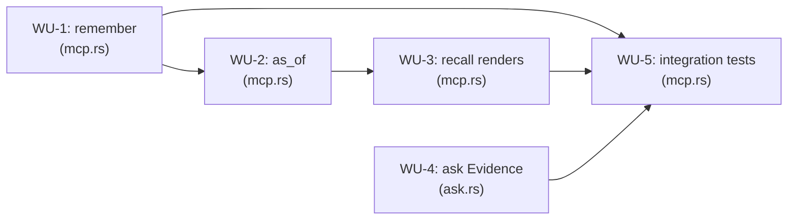

# ADR-0004 Execution Blueprint

- **Parent ADR:** `docs/adr/0004-non-lossy-mcp-surface-for-attributes-confidence-and-as-of.md`

This blueprint carries the same 5 Work Units already produced and quality-gated by
`/playbook:scope` at `.claude/plans/m2-6-non-lossy-ingest-surface.md` (gitignored, local), ported
into the ADR's tracked companion file. See that plan for the full per-scenario rationale; this
file is the `/playbook:implement`-consumable form.

## System Snapshot

- `crates/liam-daemon/src/mcp.rs`: tool handlers (`remember`, `recall`, `relate`, `ask`), args
  structs (`RememberArgs` at `mcp.rs:69-78`, `RecallArgs`/`AskArgs` at `mcp.rs:81-105`),
  `build_query` helper (`mcp.rs:48-66`), `MemoryServer` struct and constructor
  (`mcp.rs:106-206`), test module with `plain_server()`/`server_with_timeout()`/`seed()` helpers
  (`mcp.rs:702-789`).
- `crates/liam-daemon/src/ask.rs`: `Evidence` struct (`ask.rs:41-46`), `from_hit`
  (`ask.rs:51-58`), `neutralize_fence` (`ask.rs:65-67`), `render_evidence` (`ask.rs:119-135`),
  `fit_evidence_to_budget` (`ask.rs:204-228`), test helper `evidence()` (`ask.rs:357-364`, ~29
  call sites).
- `crates/liam-store/src/types.rs`: `NewNode` builders `with_attributes`/`with_valid_from`/
  `with_confidence` (`types.rs:128-147`), `Query.with_as_of` (`types.rs:230-233`), `Hit`
  (`types.rs:242-249`, no `confidence`), `ExplainedHit` (`types.rs:253-264`, has `confidence`
  and `valid_from`). No changes needed here; read-only reference.
- `crates/liam-store/src/graph.rs`: `Graph::query()`/`query_explained()` (`graph.rs:402-415`),
  `resolve_handle` (`graph.rs:319-334`), `upsert_by_supersedes_same_subject` as the
  `FixedClock` test pattern to mirror (`graph.rs:1548-1565`).

## Work Units

### WU-1: `remember` accepts and validates attributes/valid_from/confidence
- **Requires:** nothing
- **Files:** `crates/liam-daemon/src/mcp.rs` (production + tests, same file per existing convention)
- **Changes:** `RememberArgs` gains `attributes: Option<serde_json::Value>`,
  `valid_from: Option<i64>`, `confidence: Option<f64>`. New `MAX_ATTRIBUTES_CHARS: usize = 2000`
  constant (distinct from `ask.rs`'s private `MAX_EVIDENCE_CHARS`, same value by deliberate
  choice). `remember` handler validates, in order, before `self.embedder.embed(...)`: confidence
  in `0.0..=1.0` inclusive; attributes is a JSON object; attributes serialized size within
  `MAX_ATTRIBUTES_CHARS`. On success, wires into `NewNode` via `.with_attributes()`,
  `.with_valid_from(Millis(v))`, `.with_confidence(c)`. `valid_from` is deliberately given no
  range validation, unlike `confidence`/`attributes`: the store already handles a negative or
  future value without crashing or corrupting data (`decay_factor` clamps age with `.max(0)`),
  so there is no correctness reason to restrict it, only a hypothetical operator-typo case that
  doesn't warrant the same treatment as the other two fields.
- **Verification:** `cargo test -p liam-daemon --bin liamd remember`
- **Tests:**
  - attributes/valid_from/confidence round-trip via `store.query_explained()` directly.
  - confidence `-0.1`/`1.1`/`5.0`: one table-driven test, exact error text, node count unchanged.
  - confidence `0.0` and `1.0`: both accepted, both round-trip exactly.
  - attributes as array/string/number/bool: rejected, `"attributes must be a JSON object"`.
  - attributes at 2000 chars: accepted. At 2001: rejected, node count unchanged.
  - no new args set: node fields match pre-WU-1 defaults exactly (regression pin).
- **Done When:**
  - [ ] All scenarios above pass.
  - [ ] `cargo test -p liam-daemon --bin liamd` (full suite) passes unmodified elsewhere.

### WU-2: `as_of` on `RecallArgs`/`AskArgs`/`build_query`
- **Requires:** WU-1 (file-conflict avoidance only, not a logical dependency)
- **Files:** `crates/liam-daemon/src/mcp.rs`
- **Changes:** `RecallArgs`/`AskArgs` gain `as_of: Option<i64>`. `build_query` gains an
  `as_of: Option<i64>` parameter calling `q.with_as_of(Millis(v))` when set.
- **Verification:** `cargo test -p liam-daemon --bin liamd as_of`
- **Tests:**
  - Built via `DefaultGraph::open_with_clock(":memory:", GraphConfig::new(8),
    Arc::new(FixedClock::new(Millis(t0))))` wired into `MemoryServer::new(...)` directly, clock
    advanced explicitly between writes — not the real-clock `plain_server()` fixture.
  - Two versions of one subject via `upsert_by`; `as_of` at the first instant returns only the
    first version (both `recall` and `ask`).
  - `as_of` before any write for the subject returns zero hits.
  - `as_of` set to a future instant (after all writes) returns exactly one hit, the latest
    version's label, not two: asserts `hits.len() == 1` AND the label matches the current
    version, not just presence of the current one, so it actually pins exclusion of the
    superseded version (`supersede` only closes the old row's `tx_to`, not its `valid_until`;
    `live_at` checks both windows). Not merely "same as omitting `as_of`", since the two paths
    exercise different code (`supersede`'s `tx_to` close vs. `valid_until`'s `FOREVER` default).
  - `as_of` exactly at the second write's `valid_from` pins whichever inclusive/exclusive
    semantic `live_at` already implements (read `graph.rs`'s implementation first, pin it).
  - `recall`/`ask` without `as_of`: identical to today (regression pin).
- **Done When:**
  - [ ] All scenarios above pass.
  - [ ] Existing `recall`/`ask` tests pass unmodified.

### WU-3: `recall` renders confidence/attributes via `query_explained`
- **Requires:** WU-2 (genuine: needs `RecallArgs.as_of` to already exist)
- **Files:** `crates/liam-daemon/src/mcp.rs`
- **Changes:** `recall` switches from `self.store.query(&q)` to `self.store.query_explained(&q)`;
  reranker/docs/order logic reads through `.hit.*`. Output:
  `[{kind} {handle}] {label}\n{content}\nconfidence: {c:.2}\nattributes: {json}`, last two lines
  independently optional (confidence line only when != 1.0; attributes line only when non-empty).
  Bracket always exactly `[{kind} {handle}]`.
- **Verification:** `cargo test -p liam-daemon --bin liamd recall`
- **Tests:**
  - Default confidence (1.0), empty attributes: byte-identical to today (regression pin).
  - Confidence 0.6 and exactly 0.0: both shown (0.0 is non-default, guard is `!= 1.0`, mirrors
    the same boundary WU-4 pins for `ask`).
  - Non-empty attributes: shows the line; empty: does not.
  - Both non-default: shows both.
  - Two-hit mixed test (one hit with non-default fields, one without): both hits' handles still
    resolve via `head.split_once(' ')` extraction, matching
    `recall_renders_a_handle_relate_can_resolve`'s pattern — directly guards the rejected
    in-bracket design from recurring.
  - Full existing `recall` test suite passes with zero assertion changes.
- **Done When:**
  - [ ] All scenarios above pass.

### WU-4: `ask`'s `Evidence`/`render_evidence` gain confidence/attributes
- **Requires:** nothing (parallel-safe with WU-1)
- **Files:** `crates/liam-daemon/src/ask.rs`
- **Changes:** `Evidence` gains `confidence: f64`, `attributes: Option<String>`. `from_hit` sets
  `confidence` from `ExplainedHit.confidence`; sets `attributes` to
  `Some(neutralize_fence(&h.hit.attributes.to_string()))` when non-empty, `None` otherwise.
  `render_evidence` gains the same trailing-line format as `recall`, inside the existing fence.
  The `evidence()` test helper (`ask.rs:357-364`) gains default `confidence: 1.0,
  attributes: None` so its ~29 existing call sites keep compiling.
  **`is_grounded` (`ask.rs:302-316`) also gains
  `content_words(e.attributes.as_deref().unwrap_or(""))` in its `allowed` vocabulary set,
  alongside the existing `content`/`label`/`kind`.** Found by adversarial review:
  without this, an answer correctly citing an attribute-only fact (exactly `ai-notetaker`'s
  driving scenario, ADR context) scores a lower grounded-share and can wrongly trip
  `MIN_GROUNDED_SHARE` (`ask.rs:284`), falling back to raw evidence display even though the
  answer was accurate.
- **Verification:** `cargo test -p liam-daemon --bin liamd -- ask:: evidence render_evidence fit_evidence is_grounded`
- **Tests:**
  - `from_hit` on empty attributes (`{}`): `Evidence.attributes == None`.
  - `from_hit` on attributes containing fence syntax (`<<<`): neutralized, matching
    `from_hit_neutralizes_forged_fences_in_every_field`'s pattern.
  - `render_evidence` at confidence 1.0: omits the suffix (regression pin).
  - `render_evidence` at confidence 0.6 and at exactly 0.0: both show the value.
  - `render_evidence` with/without attributes: line present/absent correctly.
  - `fit_evidence_to_budget`'s existing boundary tests (exact-fit, single-oversized-item-floor)
    pass unmodified, confirming new fields are counted through the same rendering path.
  - `is_grounded` accepts an answer whose only shared vocabulary with the evidence lives in
    `attributes`, using evidence and an answer chosen so `content`/`label`/`kind` share ZERO
    4+ char words with the answer (otherwise the test can pass by incidental overlap without
    the fix actually being wired in): e.g. `content="Team roster finalized."`,
    `label="Roster note"`, `kind="fact"`,
    `attributes=Some(r#"{"venue":"riverside-pavilion"}"#.to_string())`,
    `answer="The event was held at the riverside pavilion."` — false before the fix (none of
    `event`/`held`/`riverside`/`pavilion` are in `content`/`label`/`kind`), true after.
- **Done When:**
  - [ ] All scenarios above pass.
  - [ ] Existing `ask.rs` test suite passes with zero assertion changes.

### WU-5: End-to-end integration + tool-schema registration tests
- **Requires:** WU-1, WU-3, WU-4
- **Files:** `crates/liam-daemon/src/mcp.rs` (tests only)
- **Changes:** none (test-only WU).
- **Verification:** `cargo test -p liam-daemon --bin liamd` (full suite) `&& cargo clippy --workspace --all-targets -- -D warnings && cargo fmt --all --check`
- **Tests:**
  - `remember` with attributes+confidence+valid_from, then `recall` (no `as_of`) shows both —
    full round trip through the real MCP tool surface.
  - Same fixture through `ask`: evidence blocks show the new fields.
  - `remember` → `as_of`-scoped `recall` after a second `upsert_by` returns the pre-update
    version — full MCP-surface round trip. **Uses the same `open_with_clock`/`FixedClock`
    fixture as WU-2** (blueprint line 64), clock advanced explicitly between the two writes,
    not the real-clock `plain_server()` fixture — this is the same shape of test that caused
    real-clock flakiness in WU-2 before that fix, and would silently reintroduce it here if
    built on the wrong fixture.
  - `remember`/`recall`/`ask` each registered with the new argument names
    (`server.tool_router.list_all()`), matching
    `relate_is_registered_with_the_argument_names_clients_send`'s pattern.
- **Done When:**
  - [ ] All scenarios above pass.
  - [ ] Full workspace gate green: fmt clean, clippy clean, all tests pass.

## Ordering

| WU | Requires | Parallel group |
|---|---|---|
| WU-1 | none | P1 |
| WU-2 | WU-1 | none |
| WU-3 | WU-2 | none |
| WU-4 | none | P1 |
| WU-5 | WU-1, WU-3, WU-4 | none |

## Parallel Groups

- **P1** (from the start): WU-1 (`mcp.rs`) and WU-4 (`ask.rs`). Disjoint files, no shared state,
  no dependency on each other.
- **Sequential:** WU-2 after WU-1 (same-file conflict avoidance, not a logical dependency); WU-3
  after WU-2 (genuine: needs `RecallArgs.as_of`); WU-5 after WU-1, WU-3, and WU-4.

## Dependency Graph

## Confidence + open items

- Confidence: HIGH. Every referenced type, method, and test name was verified against source
  across three rounds of adversarial review and two rounds of test review during `/playbook:scope`
  (see `.claude/plans/m2-6-non-lossy-ingest-surface-quality.md`). Two real defects were found
  and fixed before this blueprint was written: confidence-in-bracket breaking handle resolution
  (now recorded as a rejected alternative in the parent ADR), and `as_of` test flakiness from
  real-clock timing on an in-memory store (fixed via `FixedClock`, WU-2).
- Open items (verify downstream):
  - Whether `format_answer`'s compact `Sources:` line should also show confidence was resolved
    by judgment (left unchanged), not explicitly confirmed with the user — `/playbook:implement`'s
    post-implementation review should flag it if it reads as inconsistent once shipped.
  - **Accepted limitation, same treatment as `valid_from`'s non-validation:** an `as_of` at or
    beyond `FOREVER` (`Millis(4_102_444_800_000)`, year ~2100) makes `valid_until > t` false for
    every row, since `valid_until` itself defaults to `FOREVER`, silently returning zero hits for
    a genuinely live record. `as_of` gets no range validation in WU-2, matching `valid_from`'s
    precedent (no realistic caller reaches this boundary; it isn't worth the validation cost).
    Not covered by a test; documented here instead.
