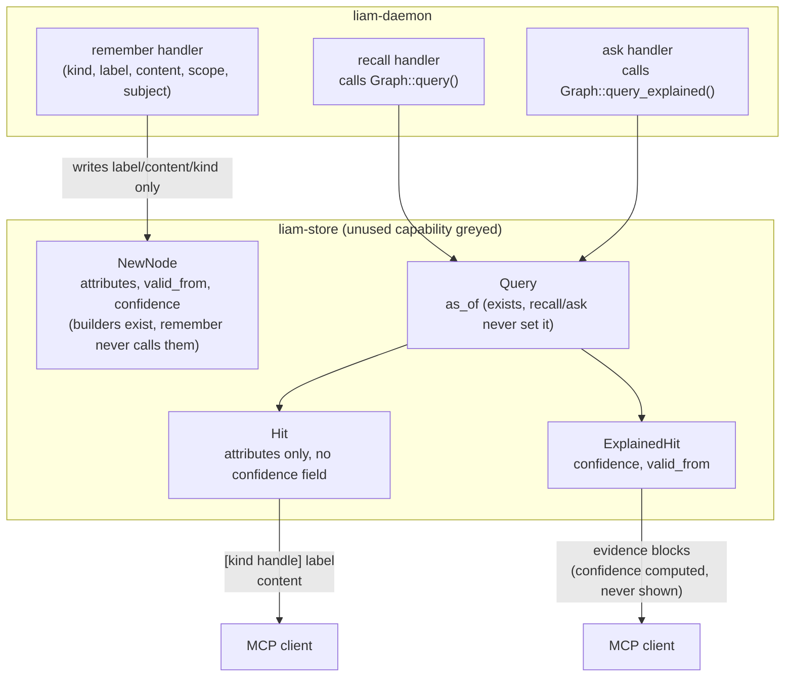
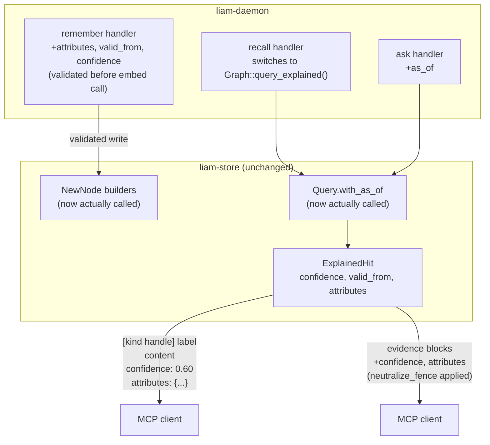

# ADR-0004: Non-lossy MCP surface for attributes, confidence, and as_of

- **Status:** Accepted
- **Date created:** 2026-08-25
- **Date modified:** 2026-08-25

## Context

LIAM's roadmap reached M2.5 (local multi-client transport) with M2.6 next: close the gap between
what `liam-store` already tracks and what an MCP client can reach. `NewNode`
(`crates/liam-store/src/types.rs:68-93`) has had `with_attributes`, `with_valid_from`, and
`with_confidence` builders since before this milestone; `Query` (`types.rs:180-238`) has had
`with_as_of` the same way. None of it is reachable through the daemon: `RememberArgs`
(`crates/liam-daemon/src/mcp.rs:69-78`) exposes only `kind`, `label`, `content`, `scope`,
`subject`; `RecallArgs`/`AskArgs` (`mcp.rs:81-105`) never expose `as_of`.

The gap is asymmetric in a way worth recording. `recall` calls `Graph::query()`, which returns
`Hit` (`types.rs:242-249`: `id, kind, label, content, attributes, score`, no `confidence`).
`ask` calls `Graph::query_explained()`, which returns `ExplainedHit`
(`types.rs:253-264`: adds `confidence`, `decay`, `valid_from`, ranks) for reasons unrelated to
this decision (citation dates, grounding). So `attributes` already flows into `recall`'s daemon
code today and is silently dropped on the floor; `confidence` never reaches `recall`'s code path
at all.

A second LIAM consumer, `ai-notetaker` (`ai-notetaker-multi-consumer-amendment`, project memory),
distills meeting facts with a confidence score and needs to ask point-in-time questions ("what
did we decide as of last Tuesday"). This milestone is what unblocks both, per the approved
`gbrain-alignment-roadmap`.

## Decision Drivers

- Every field this milestone exposes already exists at the store level
  (`types.rs:68-264`); closing the gap is provably a daemon-only change, not a schema or
  migration change.
- `ask.rs`'s injection defense (`neutralize_fence`, `ask.rs:65-67`) already treats `kind`,
  `label`, and `content` as attacker-controlled fields that must be fenced before reaching an
  LLM prompt. Any new field reaching that same surface (`attributes`) inherits that requirement,
  or the defense has a gap.
- `recall`'s bracket format (`[{kind} {handle}] {label}`) is a load-bearing contract:
  `recall_renders_a_handle_relate_can_resolve` (`mcp.rs:1713-1757`) and `resolve_handle`
  (`crates/liam-store/src/graph.rs:319-334`, rejects non-alphanumeric input) both depend on the
  bracket containing exactly `{kind} {handle}` and nothing else.

## Considered Alternatives

### New dedicated tools (`remember_full`/`recall_full`, or `set_attributes`/`get_metadata`) (effort: M-L)
- Keep `remember`/`recall`/`ask` exactly as they are; add parallel tools for the richer path.
- Trade-offs: existing clients see zero surface change. But it doubles the tool count for what
  is fundamentally one operation with more optional detail, forces a client to learn which tool
  to call for which case, and duplicates every future change to the underlying logic across two
  code paths.

### Add `confidence` to `Hit` directly, a `liam-store` change (effort: S)
- Add `confidence: f64` to `Hit`, populate it where `query()` currently drops it.
- Trade-offs: a smaller diff at the `recall` call site (no need to switch to
  `query_explained()`). But it contradicts this milestone's own premise (everything needed
  already exists) by adding new store surface, and creates two near-duplicate fields
  (`Hit.confidence` and `ExplainedHit.confidence`) that must be kept in sync forever, with the
  same question recurring for every future field `ExplainedHit` gains. `query()` is already
  `query_core().into_iter().map(|e| e.hit).collect()` — `query_explained()` computes the
  identical candidate set, so switching `recall` to call it is zero-risk and adds no new code.

### Render `confidence` inside the existing bracket (effort: S, REJECTED with a verified failure)
- `[{kind} {handle} confidence:{c:.2}] {label}` — all metadata on one compact line.
- Trade-offs: this was the milestone's own first design. `recall_renders_a_handle_relate_can_resolve`
  extracts the handle via `head.split_once(' ')` on bracket content; `resolve_handle` rejects any
  non-alphanumeric character. A confidence-bearing hit's extracted "handle" becomes
  `"<handle> confidence:0.75"`, which `resolve_handle` rejects outright — every confidence-bearing
  hit would become impossible to `relate`. Found during this decision's own adversarial review
  before any code was written, and verified against source before being rejected.

### Full structured JSON responses for `remember`/`recall`/`ask` (effort: L/XL, deferred)
- Every tool returns a JSON object/array instead of formatted text.
- Trade-offs: eliminates future formatting ambiguity entirely (including the accepted limitation
  below). But it breaks every existing client parsing today's plain-text conventions (`recall`'s
  bracket-and-line format, `ask`'s `Sources:` index), a breaking change disproportionate to
  exposing four already-existing fields. Worth reconsidering if the MCP surface needs a larger
  overhaul later (deployment work, M6), not as a side effect of this milestone.

### No daemon change: encode confidence/attributes into existing content/label by convention (effort: XS, REJECTED)
- A caller like `ai-notetaker` writes a confidence score or metadata as text inside `content` or
  `label` (e.g. `"[confidence: 0.8] the rollout is approved"`), with no MCP surface change at all.
- Trade-offs: genuinely the cheapest option, and worth naming given this ADR's own premise is
  "everything needed already exists." Rejected because it pollutes searchable, LLM-facing
  content with formatting noise, loses the structure `NewNode.attributes`/`confidence` already
  give for free, and pushes every future consumer to invent and parse its own ad hoc convention
  instead of a shared one. The cost this ADR pays (a bounded daemon change) buys a real
  structured field instead of a string convention nobody has to agree on twice.

## Decision

Widen `remember`, `recall`, and `ask` in place with new optional arguments, rather than adding
parallel tools (rejects "dedicated tools": no compounding benefit at this scope, real ongoing
cost). `recall` switches internally to `Graph::query_explained()` rather than adding a field to
`Hit` (rejects the `liam-store` change: `query_explained()` already exists, already computes
everything needed, and the store surface stays exactly as documented — untouched). Confidence
and attributes render as independently-optional **trailing lines** after content, never inside a
bracket or header line anything parses structurally (rejects the in-bracket design, whose
failure mode is now recorded here rather than rediscovered later). Plain-text rendering is kept
for both tools (structured JSON deferred: disproportionate blast radius for this milestone's
actual goal).

`attributes` reaching `ask`'s evidence is always passed through the existing `neutralize_fence`,
the same treatment `kind`/`label`/`content` already get, since it is exactly the class of
attacker-controlled field that sanitizer exists for. `recall`'s `content` line is explicitly
**not** given the same treatment: `recall`'s output feeds a client application reading
informational text, never an executed LLM prompt, so the risk class differs from `ask`'s, and no
naive suffix-parsing client exists in this codebase today to be confused by it. This is an
accepted, documented limitation, not an oversight.

Batch/atomic multi-node episode ingest is explicitly out of scope: it needs a new
store-level transactional primitive, a different shape of problem than exposing fields that
already exist, and belongs to milestone M3.

## Consequences

- Closes the gap with zero `liam-store` changes, zero migration, and backward-compatible output:
  any node not using the new fields renders byte-identical to today.
- Unblocks `ai-notetaker`'s confidence-scored writes and point-in-time recall, the driving
  scenario for this milestone.
- Establishes the trailing-line rendering convention (already used for `attributes`) as the
  general shape for future optional per-hit metadata, rather than inventing a new one each time
  a field is added.
- Accepted trade-off: `recall`'s content line remains unfenced, so a memory whose own content
  happens to end in a line starting with `confidence: ` or `attributes: ` is ambiguous to a
  hypothetical naive client-side parser. Revisit only if such a parser is ever built against this
  surface.
- Follow-up: batch/atomic multi-node ingest becomes M3's own decision to scope and record,
  once M3 is planned.
- Follow-up: whether `format_answer`'s compact `Sources:` citation line should also carry
  confidence was resolved by judgment during scoping, not confirmed with the user; worth
  revisiting if it reads as inconsistent once shipped.

## Architecture Diagrams

### Current state

### Proposed state

