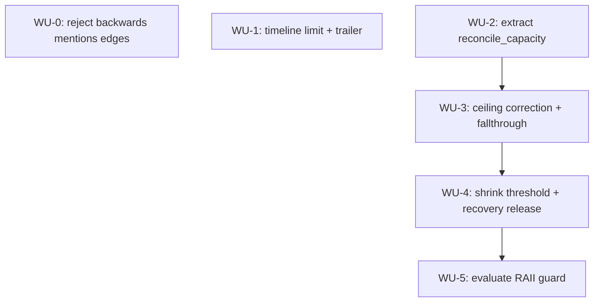

# ADR-0005 Execution Blueprint

- **Parent ADR:** [docs/adr/0005-aimd-decide-falls-through-on-a-failed-ceiling-correction.md](0005-aimd-decide-falls-through-on-a-failed-ceiling-correction.md)

## System Snapshot

- `crates/liam-daemon/src/tuning.rs`: `AimdHandles` (90-96: `generation_permits: Arc<Semaphore>`,
  `granted_capacity: Arc<AtomicUsize>`, `held_permit: Arc<Mutex<Option<OwnedSemaphorePermit>>>`,
  `evaluating: Arc<AtomicBool>`, `previous_window_average: Arc<Mutex<Option<Duration>>>`),
  `record_and_maybe_evaluate` (102-128), `evaluate`/`evaluate_with_hooks`/`EvaluationHooks`
  (132-192), `decide` (196-219), `grow` (223-236), `shrink` (240-256), `IMPROVEMENT_THRESHOLD:
  f64 = 0.10` (263), `memory_ceiling`/`compute_ceiling` (271-287), `cold_start_benchmark`
  (289-343). Test module has `test_handles` helper (~730) and existing `aimd_*` tests including
  `aimd_grows_step_by_step_while_queue_wait_dominates` (778),
  `aimd_releases_the_held_permit_instead_of_growing_on_top_of_it` (845-886),
  `aimd_first_evaluation_skips_the_did_it_help_check` (946),
  `aimd_single_flight_guard_lets_only_one_evaluation_run_at_a_time` (977-1008).
- `crates/liam-daemon/src/main.rs`: `build_autotuned_server` (216-258),
  `reconcile_capacity_after_benchmark` (269-288), its sole call site (253), its 6 tests
  (575-687).
- `crates/liam-daemon/src/mcp.rs`: `remember`'s edge-validation loop (660-730, per-edge checks at
  691-710), `TimelineArgs` (366-370), `timeline` (1090-1131), `TIMELINE_MENTIONS_LIMIT` (83),
  `parse_fact_ref`/`parse_entity_ref`/`is_handle_shaped` (161-185), `PermitTimer`'s `impl Drop`
  (471-479, the RAII precedent this blueprint's WU-5 follows).
- `crates/liam-daemon/src/ask.rs`: `clamp_ask_k` (26-28) and its test
  `clamp_ask_k_defaults_and_bounds_the_evidence_count` (439-454), the pattern WU-1's
  `clamp_timeline_limit` mirrors.
- `crates/liam-store/src/types.rs`: `NewNode::entity` (119), confirming a node's `kind` is
  arbitrary caller-supplied text with no reserved entity marker (grounds WU-0's scope boundary).

## Work Units

### WU-0: Reject backwards mentions edges in remember

- Requires: nothing
- Goal: `remember` rejects a `mentions` edge whose `to` is a fresh entity or whose `from` is a
  fact, at write time, with no partial write.
- Files:
  - `crates/liam-daemon/src/mcp.rs` (production: edge-validation loop ~691-710; test: new cases
    near `remember_with_episode_rejects_supersedes_edge_kind`, ~2286)
- Verification: `cargo test -p liam-daemon --bin liamd`, `cargo clippy -p liam-daemon
  --all-targets -- -D warnings`, `cargo fmt --all -- --check`
- Tests:
  - Given a `mentions` edge with `to` as `entity:N`, when `remember` runs, then it fails naming
    the edge index and direction problem, nothing written.
  - Given a `mentions` edge with `from` as `fact:N`, when `remember` runs, then it fails the same
    way.
  - Given a correctly-directed `mentions` edge (`from` entity, `to` fact), when `remember` runs,
    then it succeeds unchanged (regression pin against
    `remember_synthesizes_a_mentioned_entity_from_its_real_mention_content`).
  - Given a `mentions` edge with `from` as a handle (pre-existing node), when `remember` runs,
    then it succeeds AND the edge is positively confirmed written (a `"related ...
    -mentions-> ..."` line in the response, or an independent read), not just "no rejection
    string appeared."
- Done When:
  - [ ] Backwards-direction `mentions` edges (fresh entity as `to`, fact as `from`) are rejected.
  - [ ] Correctly-directed `mentions` edges still succeed.
  - [ ] Handle-shaped references are not rejected by this check (documented scope boundary).
  - [ ] All three verify commands pass clean.

### WU-1: timeline gains limit + "N more" trailer

- Requires: nothing
- Goal: `timeline` accepts an optional `limit` (default 50, max 200), and its response indicates
  when mentions were capped, without claiming a specific count it cannot prove.
- Files:
  - `crates/liam-daemon/src/mcp.rs` (production: `TimelineArgs` 366-370, `timeline` 1090-1131,
    `TIMELINE_MENTIONS_LIMIT` 83; test: near 5382-5525)
  - `README.md` (`timeline` args table, ~148-150)
  - `CHANGELOG.md` (`timeline` bullet, ~22)
- Verification: `cargo test -p liam-daemon --bin liamd`, `cargo clippy -p liam-daemon
  --all-targets -- -D warnings`, `cargo fmt --all -- --check`
- Tests:
  - `clamp_timeline_limit` DB-free unit tests mirroring `clamp_ask_k_defaults_and_bounds_the_evidence_count`:
    `None` -> default 50; in-range passes through; exactly `MAX_TIMELINE_LIMIT` passes through;
    above `MAX_TIMELINE_LIMIT` clamps down; `0` floors to `1`.
  - Given fewer mentions than the default limit, when `timeline` runs with no `limit`, then all
    show and no trailer appears (regression pin against
    `timeline_returns_compiled_content_and_mentions_most_recent_first`).
  - Given more mentions than a caller-supplied `limit`, when `timeline` runs with that `limit`,
    then exactly `limit` mentions show, most-recent-first, then the "and more" trailer. Use
    `server_with_clock`/`FixedClock` with explicit monotonic `clock.set(Millis(...))` calls,
    mirroring `mcp.rs:5385-5411`, not real wall-clock time.
  - Given exactly `limit` mentions (not more), when `timeline` runs, then all show with NO
    trailer (distinct boundary case from the capped scenario above).
- Done When:
  - [ ] `timeline` accepts optional `limit`, defaulting to current behavior (50) when absent.
  - [ ] `clamp_timeline_limit` has unit tests covering None/in-range/at-cap/over-cap/zero.
  - [ ] Capped result shows "and more" trailer with no count; uncapped and exactly-at-limit
        results do not.
  - [ ] The ordering test uses `FixedClock`.
  - [ ] README and CHANGELOG mention the new parameter.
  - [ ] All three verify commands pass clean.

### WU-2: Extract reconcile_capacity into tuning.rs

- Requires: nothing
- Goal: pure code-motion refactor, zero behavior change, zero test count change.
- Files:
  - `crates/liam-daemon/src/main.rs` (remove `reconcile_capacity_after_benchmark` ~269-286 and its
    6 tests ~576-690; update call site ~253)
  - `crates/liam-daemon/src/tuning.rs` (add the moved function, renamed `reconcile_capacity`, and
    its 6 moved tests)
- Verification: `cargo test -p liam-daemon --bin liamd`, `cargo clippy -p liam-daemon
  --all-targets -- -D warnings`, `cargo fmt --all -- --check`
- Tests: none new; the 6 moved tests pass unchanged in their new location, renamed
  `reconcile_capacity_*`. Total workspace test count is unchanged: capture the baseline with
  `cargo test -p liam-daemon --bin liamd 2>&1 | grep "test result:"` before moving anything, and
  diff the passed-count against the same command run after the move.
- Done When:
  - [ ] `reconcile_capacity_after_benchmark` no longer exists in `main.rs`; `reconcile_capacity`
        exists in `tuning.rs` with identical logic.
  - [ ] All 6 moved tests pass unchanged in their new location.
  - [ ] `main.rs`'s call site compiles against `tuning::reconcile_capacity`.
  - [ ] The captured before/after `test result:` passed-counts are equal.
  - [ ] All three verify commands pass clean.

### WU-3: decide() corrects granted capacity against a dropped ceiling

- Requires: WU-2
- Goal: `decide()` corrects `granted_capacity` down to `ceiling` when possible, and falls through
  to the ordinary decision (using an unconditionally-updated `previous_window_average`) when the
  correction cannot fully succeed.
- Files:
  - `crates/liam-daemon/src/tuning.rs` (`decide`, currently 196-219; production + new tests)
- Verification: `cargo test -p liam-daemon --bin liamd`, `cargo clippy -p liam-daemon
  --all-targets -- -D warnings`, `cargo fmt --all -- --check`
- Tests:
  - Given `granted_capacity > ceiling` with the excess reclaimable, when `decide()` runs, then
    capacity corrects exactly to `ceiling`, `previous_window_average` updates to this window's
    total, and the ordinary shrink/recovery/grow logic does not also run.
  - Given `granted_capacity = 6` and `ceiling = 4` (excess = 2) with 5 of the 6 permits held
    (bind them to a named, scope-lived variable, e.g. `let _held: Vec<_> = ...`, kept alive
    across the `decide()` call, via `Semaphore::acquire_owned` before calling `decide()`; do not
    bind to `_`, which drops the permits immediately and silently turns this into a "permits
    free" test). Holding 5 of 6 leaves exactly 1 permit available, so `reconcile_capacity`'s
    `try_acquire_many(2)` fails (only 1 available, needs 2) without blocking; holding all 6 would
    make `shrink()`'s own `acquire_owned().await` inside the fallthrough hang forever with
    nothing left to acquire, so at least one permit must remain free. Seed
    `previous_window_average` with a `prev` and pass a `window_total` such that `window_total >
    prev` under WU-3's own pre-WU-4 comparison (WU-4 introduces `SHRINK_REGRESSION_THRESHOLD`
    later; this WU tests against the comparison as it exists before that change, to keep WU-3
    independently testable and compilable on its own). When `decide()` runs, then
    `granted_capacity` remains above `ceiling` (the correction failed, as expected) AND
    `handles.held_permit` becomes `Some` (or `generation_permits.available_permits()` drops by
    exactly one from its post-hold value), proving `shrink()` actually executed that window
    rather than the fallthrough silently doing nothing. This is the test that would have caught
    the rejected alternative A's flaw; a vaguer assertion (e.g. only that
    `previous_window_average` updated, which happens unconditionally before this branch even
    runs) would not catch a fallthrough that runs but discards its result.
  - Given `granted_capacity <= ceiling`, when `decide()` runs, then this check is a no-op and
    existing latency logic proceeds unchanged (regression pin against existing `aimd_*` tests).
- Done When:
  - [ ] A window with `granted_capacity > ceiling` and reclaimable excess corrects to `ceiling`
        and skips the latency decision that window.
  - [ ] A window with `granted_capacity > ceiling` and unreclaimable excess leaves capacity
        uncorrected but still runs the ordinary decision (the fallthrough fix).
  - [ ] `previous_window_average` updates on every `decide()` call, including corrected and
        fallthrough paths.
  - [ ] A window with `granted_capacity <= ceiling` is unaffected.
  - [ ] Existing `aimd_*` tests still pass unchanged.
  - [ ] All three verify commands pass clean.

### WU-4: decide() gains a 10% shrink threshold and unconditional recovery release

- Requires: WU-3
- Goal: shrink only on a regression exceeding `SHRINK_REGRESSION_THRESHOLD`; recover a held-back
  permit on any non-regressing window, not only a queue-wait-dominant one.
- Files:
  - `crates/liam-daemon/src/tuning.rs` (`decide` 196-219, `grow` 223-236; production + new tests)
- Changes (in addition to the split of `grow()` and the new `SHRINK_REGRESSION_THRESHOLD`
  constant described in the parent plan): extract the boundary computation into a private helper,
  `fn shrink_bar(prev: Duration) -> Duration { prev.mul_f64(1.0 + SHRINK_REGRESSION_THRESHOLD) }`,
  and have both `decide()`'s comparison and the boundary test below call it. This closes a
  flakiness risk: `1.0 + SHRINK_REGRESSION_THRESHOLD` is not exactly representable in binary
  floating point, so a test that independently re-derives the arithmetic (even the same-looking
  expression written twice) is not guaranteed to round to the same nanosecond value as
  production's computation. Sharing one function removes that risk entirely rather than relying
  on both sides staying textually identical.
- Verification: `cargo test -p liam-daemon --bin liamd`, `cargo clippy -p liam-daemon
  --all-targets -- -D warnings`, `cargo fmt --all -- --check`
- Tests:
  - Three-point threshold test with fixed `prev = Duration::from_millis(1000)`, using
    `shrink_bar(prev)` (not a re-derived expression) as the boundary: 1ms under `shrink_bar(prev)`
    does not shrink; exactly `shrink_bar(prev)` does not shrink (proves strict `>`, not `>=`); 1ms
    over shrinks.
  - Given a held-back permit and a non-regressing, non-queue-wait-dominant window, when
    `decide()` runs, then the held-back permit releases.
  - Given a held-back permit and a non-regressing, queue-wait-dominant window, when `decide()`
    runs, then the held-back permit releases (not a new grow); assert BOTH `granted_capacity`
    stays flat AND `available_permits()` increases by exactly 1, mirroring
    `aimd_releases_the_held_permit_instead_of_growing_on_top_of_it` (`tuning.rs:879-885`).
  - Given no held-back permit and a queue-wait-dominant, non-regressing window, when `decide()`
    runs, then new capacity grows (regression pin against
    `aimd_grows_step_by_step_while_queue_wait_dominates`).
  - Given `previous` is `None` (first evaluation), when `decide()` runs, then it still takes the
    grow-check path unchanged (regression pin against
    `aimd_first_evaluation_skips_the_did_it_help_check`).
- Done When:
  - [ ] A window 1ms under the threshold boundary does not shrink.
  - [ ] A window exactly on the boundary does not shrink.
  - [ ] A window 1ms over the boundary shrinks.
  - [ ] A non-regressing, non-queue-wait-dominant window with a held-back permit releases it.
  - [ ] A non-regressing, queue-wait-dominant window with a held-back permit releases it, proven
        by both `granted_capacity` and `available_permits()`.
  - [ ] A non-regressing, queue-wait-dominant window with no held-back permit still grows.
  - [ ] The first-evaluation path is unchanged.
  - [ ] `SHRINK_REGRESSION_THRESHOLD` is distinct from `IMPROVEMENT_THRESHOLD`.
  - [ ] `decide()` and the boundary test both call the same `shrink_bar` helper (no duplicated
        arithmetic).
  - [ ] All three verify commands pass clean.

### WU-5: evaluate()'s guard reset becomes an RAII scope guard

- Requires: WU-4
- Goal: `handles.evaluating` resets via a `Drop` guard in both `evaluate` and
  `evaluate_with_hooks`, surviving a panic mid-decision.
- Files:
  - `crates/liam-daemon/src/tuning.rs` (`evaluate` 132-148, `evaluate_with_hooks` 152-172;
    production + new tests)
- Verification: `cargo test -p liam-daemon --bin liamd`, `cargo clippy -p liam-daemon
  --all-targets -- -D warnings`, `cargo fmt --all -- --check`
- Tests:
  - Integration-level (required, not optional): a `#[cfg(test)]`-gated seam makes `decide()`
    panic deterministically. The seam must panic from inside the real `decide()` call graph
    invoked through `evaluate()`'s normal path, not from a bypass that skips `decide()`'s own
    logic (e.g. a `#[cfg(test)] fn poison_next_decide()` flag checked at the top of `decide()`
    itself, so the panic happens where a real panic in this function would). Drive it via
    `tokio::spawn(evaluate(handles.clone(), ...))`, mirroring
    `aimd_single_flight_guard_lets_only_one_evaluation_run_at_a_time` (`tuning.rs:986-998`),
    expecting `Err` from the `JoinHandle`. Assert BOTH `handles.evaluating.load(Ordering::Acquire)
    == false` AND a subsequent `evaluate()` call on the same handles actually runs.
  - An isolated `EvaluatingGuard`-only unit test (via `std::panic::catch_unwind`) may be added
    additionally but does not replace the integration test.
  - Existing single-flight guard tests continue to pass unchanged.
- Done When:
  - [ ] `handles.evaluating` resets via an RAII guard in both `evaluate` and
        `evaluate_with_hooks`.
  - [ ] An integration-level test drives a real panic through `evaluate()`'s normal call path into
        `decide()` (not a bypass) and proves both the reset AND that a subsequent `evaluate()`
        call runs afterward.
  - [ ] Existing single-flight guard tests pass unchanged.
  - [ ] All three verify commands pass clean.

## Ordering

| WU | Requires | Parallel group |
|---|---|---|
| WU-0 | none | none |
| WU-1 | none | none |
| WU-2 | none | none |
| WU-3 | WU-2 | none |
| WU-4 | WU-3 | none |
| WU-5 | WU-4 | none |

## Parallel Groups

None. WU-0 and WU-1 have no dependency edge but both touch `crates/liam-daemon/src/mcp.rs`
(shared-file risk), so they are left sequential rather than marked parallel-safe. WU-2 through
WU-5 form a real dependency chain inside `tuning.rs`/`main.rs`.

## Dependency Graph

## Confidence + open items

- Confidence: HIGH for WU-0, WU-1, WU-2 (grounded against real current code, small bounded
  changes, clear in-file precedents, test scenarios positively assert success paths). HIGH for
  WU-3 after the fallthrough-correction revision (the flaw rejected alternative A had is now
  explicitly designed against and tested). MEDIUM for WU-4 (splitting `grow()` touches a
  currently-tested "never both in the same call" invariant; verify `Duration::mul_f64` is
  available on this crate's Rust edition during implementation). MEDIUM for WU-5 (the exact
  mechanism for making `decide()` panic deterministically in a test-only seam is a requirement,
  not a fully worked implementation; depends on `decide`'s real signature at implementation
  time).
- Open items (verify downstream):
  - WU-0's exact error message wording should match the sibling checks' voice in
    `crates/liam-daemon/src/mcp.rs`'s edge-validation loop; not fully specified here, left to
    `/playbook:implement`'s grounding pass.
  - WU-1's `MAX_TIMELINE_LIMIT = 200` was chosen during scoping, not explicitly confirmed against
    real usage patterns; flagging in case it needs adjustment later.
  - `relate`'s inability to validate mentions-edge direction (no persisted entity-ness marker) is
    explicitly out of scope for this ADR; a future design doc (a persisted entity-ness marker)
    would be needed if this becomes a real problem.
  - WU-5's exact test-only panic-seam mechanism is left to the implementer, chosen against
    `decide`'s real current signature; the Done-When criteria are precise about what the test
    must prove even though the mechanism isn't pre-specified.
  - The pre-existing, unsynchronized race between `main.rs`'s post-benchmark
    `reconcile_capacity_after_benchmark` call and `decide()`'s AIMD calls on `granted_capacity`
    (see the parent ADR's Consequences section) is not fixed by this blueprint. WU-2 through WU-4
    do not add new synchronization; they reuse the existing atomics. A future ADR should cover
    synchronizing all writers of `granted_capacity`.
