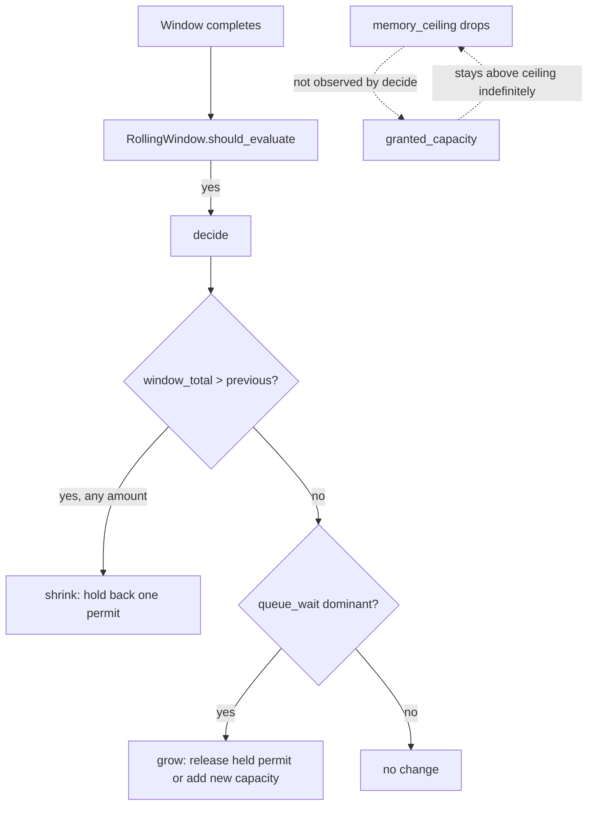
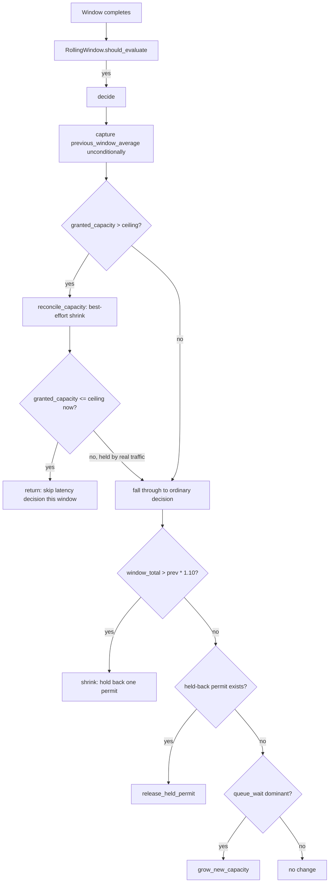

# ADR-0005: AIMD decide() falls through to the ordinary decision on a failed ceiling correction

- **Status:** Accepted
- **Date created:** 2026-09-07
- **Date modified:** 2026-09-07

## Context

The M2b entity-pages PR review (PRs #120-#126, merged) left five follow-up findings recorded in
`.claude/plans/m2b-entity-pages.md`. Three of them concern the AIMD adaptive-concurrency loop in
`crates/liam-daemon/src/tuning.rs`:

- `memory_ceiling()` (`tuning.rs:271-287`) tracks live RAM and produces a ceiling, but
  `AimdHandles.granted_capacity` (`tuning.rs:90-96`) never shrinks purely because the ceiling
  dropped. Capacity only moves in `decide()` (`tuning.rs:196-219`), which reacts to latency, not
  to the ceiling directly.
- `decide()` shrinks on any latency regression however small (`window_total > prev`, no
  threshold), and only grows back via `grow()` (`tuning.rs:223-236`) when a window is
  queue-wait-dominant. A held-back permit from a past shrink has no path back to the pool once
  load normalizes if the window never becomes queue-wait-dominant again.
- `evaluate()`'s single-flight guard (`AimdHandles.evaluating: Arc<AtomicBool>`) is reset by a
  plain `handles.evaluating.store(false, Ordering::Release)` statement after `decide().await`
  (`tuning.rs:132-172`), not a scope guard. A panic mid-decision would wedge the guard
  permanently. No live trigger exists today, but the pattern is already precedented safely
  elsewhere in this codebase (`PermitTimer`'s `impl Drop`, `crates/liam-daemon/src/mcp.rs:471-479`).

`main.rs` already has a working shrink mechanism for the ceiling case:
`reconcile_capacity_after_benchmark` (`main.rs:269-288`) moves `granted_capacity` toward a target,
capped at a ceiling, using `try_acquire_many` plus `.forget()` for a best-effort shrink (it
cannot reclaim permits currently held by real traffic). It only runs once, after the cold-start
benchmark; it never runs on the recurring AIMD path.

An initial design during `/playbook:scope`'s scoping interview proposed reusing this mechanism
inside `decide()`: on every window, if `granted_capacity > ceiling`, run the correction and
unconditionally skip the rest of `decide()`'s latency-based logic for that window. A `critic`
agent's adversarial review (Phase 2 of the scope quality gate) found this design would disable
the AIMD control loop entirely for as long as a busy period lasted: `reconcile_capacity`'s shrink
is best-effort and fails under sustained load, which is exactly the load condition the memory
ceiling exists to guard against. A `decide()` that gives up on regression/recovery/growth every
time the correction is *attempted*, rather than when it *succeeds*, is worse than the bug it was
meant to fix.

## Decision Drivers

- The memory ceiling correction must never make AIMD's core control loop go inert under load,
  the load condition that both the ceiling and the loop exist to handle (`tuning.rs:271-287`,
  `main.rs:269-288`).
- `previous_window_average` (`tuning.rs:94`) must stay current every window, since it is the
  sole baseline `decide()`'s regression check compares against; the original design's early
  return skipped updating it, corrupting the next window's comparison.
- Any latency-shrink threshold this loop introduces must not silently reuse
  `IMPROVEMENT_THRESHOLD` (`tuning.rs:263`), which already gates an unrelated question ("is a
  higher benchmark concurrency level worth the memory") inside `cold_start_benchmark`'s plateau
  detection.
- A single-flight guard reset via a plain statement is a known Rust footgun; this codebase
  already has a working RAII precedent (`PermitTimer`, `mcp.rs:471-479`) rather than inventing a
  new pattern.

## Considered Alternatives

### A: unconditional early return on any correction attempt (effort: S)

- `decide()` checks `granted_capacity > ceiling` first; if so, calls `reconcile_capacity` and
  `return`s immediately, regardless of whether the correction actually reclaimed capacity.
- Trade-offs: simplest to write and reason about in isolation. Fails exactly under sustained
  load: `reconcile_capacity`'s `try_acquire_many` returns `Err` when real traffic holds the
  excess permits, so the correction is a no-op every window, and the early return still fires,
  meaning the regression/recovery/growth loop never runs for as long as the busy period lasts.
  This was the design flagged by adversarial review; rejected.

### B: a dedicated timer-driven reconciliation task, independent of the AIMD window (effort: L)

- Spawn a periodic `tokio::time::interval` task that checks `granted_capacity` against
  `memory_ceiling()` on a wall-clock cadence, decoupled from `RollingWindow::should_evaluate`'s
  call-count-driven windows.
- Trade-offs: decouples ceiling correction from traffic volume, so a ceiling drop during a quiet
  period still gets corrected promptly. Adds a new concurrency primitive (a background task and
  its own shutdown/lifecycle) to a module that currently has none; `AimdHandles` and
  `RollingWindow` are deliberately call-count-driven with no real-time timer today (confirmed: no
  `tokio::time` usage in `tuning.rs`). The coordination cost is disproportionate to the problem:
  `decide()` already runs on every window, and windows are driven by real request volume, so a
  quiet period is, by definition, not under memory pressure from this workload. Rejected as
  over-engineered for the actual failure mode. (Note: this alternative would add a *third* writer
  of `granted_capacity`, on top of the two that already exist in production today; see the
  Consequences section for the pre-existing race between those two, which this ADR does not
  introduce and does not fix.)

### C: ceiling correction inside decide(), fallthrough to the ordinary decision on failure (effort: M, chosen)

- Restructure `decide()`: capture `previous_window_average` unconditionally at the top of every
  call. If `granted_capacity > ceiling`, call `reconcile_capacity` (moved from `main.rs` into
  `tuning.rs` as a shared helper, since it now serves two callers). Re-check afterward: if
  correction succeeded (`granted_capacity <= ceiling`), skip the latency decision for this window
  (its numbers were measured against stale, over-ceiling capacity). If it failed (still `>
  ceiling`), fall through to the ordinary regression/recovery/growth decision using the
  `previous` value already captured.
- Trade-offs: reuses the existing best-effort `reconcile_capacity` mechanism and the existing
  window cadence, no new concurrency primitive. Requires threading a success/failure branch
  through `decide()` and hoisting the `previous_window_average` update, a real but bounded
  restructuring (~340 lines across two Work Units, WU-3 and WU-4 in the companion blueprint).
  Chosen because it closes the exact gap (ceiling drops are ignored) without introducing the
  failure mode alternative A has, and without alternative B's disproportionate cost.
- A narrower sub-decision inside C: skip the latency decision only when the correction *succeeds*,
  not on every attempt (as opposed to always falling through to the ordinary decision regardless
  of outcome). Always falling through was considered and rejected: a successful correction changes
  `granted_capacity` mid-window, so `window_total`'s latency numbers were measured against the
  pre-correction capacity and are not a fair input to a shrink/grow decision about the
  post-correction capacity. Skipping only on success avoids feeding a stale measurement into the
  ordinary decision while still guaranteeing the ordinary decision runs on every window where the
  correction did not (or did not need to) change anything.

## Decision

Adopt alternative C. `decide()` gains a hard ceiling correction that runs before the
latency-based decision, using the existing window cadence and the existing
`reconcile_capacity_after_benchmark` mechanism (renamed `reconcile_capacity` and moved into
`tuning.rs`, since it becomes AIMD's own primitive, not a benchmark-only one). The correction
only substitutes for the latency decision when it actually succeeds; a failed correction (excess
permits held by real traffic) falls through to the ordinary decision, so a sustained-load period
never disables the control loop that exists to protect it.

The latency-shrink threshold gets its own constant, `SHRINK_REGRESSION_THRESHOLD = 0.10`,
distinct from `IMPROVEMENT_THRESHOLD`, because the two answer different questions and coupling
them would let an unrelated change to the benchmark's threshold silently retune AIMD's
sensitivity. Alternative A is rejected for the control-loop failure mode above. Alternative B is
rejected as introducing a new concurrency primitive to solve a problem the existing window
cadence already addresses whenever traffic is actually present.

Two smaller, related decisions ride in this same record because they touch the same module and
were scoped together:

- Recovery: a non-regressing window unconditionally attempts to release a held-back permit
  before the existing queue-wait-dominant growth check, so a held-back permit has a path back to
  the pool once load normalizes, not only when the window happens to be queue-wait-dominant
  again.
- Panic safety: `evaluate()`'s single-flight guard resets via an RAII scope guard (mirroring the
  existing `PermitTimer::Drop` pattern), not a plain statement, so a future panic mid-decision
  cannot wedge the guard permanently.

## Consequences

- **Positive:** the AIMD control loop keeps running its regression/recovery/growth decision even
  when a memory-ceiling correction cannot fully succeed, closing the adversarial-review-flagged
  gap without a regression.
- **Positive:** a held-back permit recovers automatically once load normalizes, without waiting
  for a queue-wait-dominant window, closing follow-up finding 4 from the M2b review.
- **Positive:** `evaluate()`'s guard reset is panic-safe going forward, closing follow-up finding
  5, with no live trigger required to justify the change (RAII is strictly safer than the plain
  statement it replaces at no added complexity).
- **Negative:** `decide()` grows two new top-level branches beyond its current two (ceiling
  correction, then unconditional recovery release, on top of the existing threshold-gated shrink
  and queue-wait growth), increasing the function's cognitive load; mitigated by splitting
  `grow()` into `release_held_permit` and `grow_new_capacity` so each branch reads as one call.
- **Accepted risk, pre-existing, not introduced or fixed by this record:** `granted_capacity` and
  its semaphore already have two unsynchronized writers in production: `main.rs`'s one-time
  post-benchmark `reconcile_capacity_after_benchmark` call (spawned concurrently with the server
  already accepting requests, `main.rs:241-254`) and `decide()`'s own existing `grow()` call
  (`tuning.rs:223-236`, the only other writer of `granted_capacity`; `shrink()` only holds back a
  permit and never touches `granted_capacity` itself, per its own doc comment at
  `tuning.rs:238-239`). Both writers perform a load-then-conditionally-mutate on plain atomics
  with no shared lock. This
  ADR gives `decide()` a second, recurring call into the same `reconcile_capacity` function
  (renamed from `reconcile_capacity_after_benchmark`), which does not create this race but does
  increase how often it can occur: `main.rs`'s benchmark-completion call and a `decide()` window
  closing at the same moment can each read a stale `current` value and independently move the
  semaphore, drifting `granted_capacity` from the semaphore's real permit count. Fixing this
  properly needs a shared lock or CAS around every writer of `granted_capacity`, which touches
  `MemoryServer`'s handle-exposure surface (`generation_permits_handle`/`granted_capacity_handle`)
  beyond this record's scope. Left as a named follow-up, not silently accepted: a future ADR
  should cover synchronizing all writers of `granted_capacity`.
- **Follow-up:** `relate`'s mentions-direction validation gap (a separate follow-up finding, not
  part of this AIMD decision) remains open; no persisted "this node is an entity" marker exists
  in the schema to validate against for arbitrary already-existing handles. Tracked as future
  work, not fixed by this record.

## Architecture Diagrams

### Current state

### Proposed state

